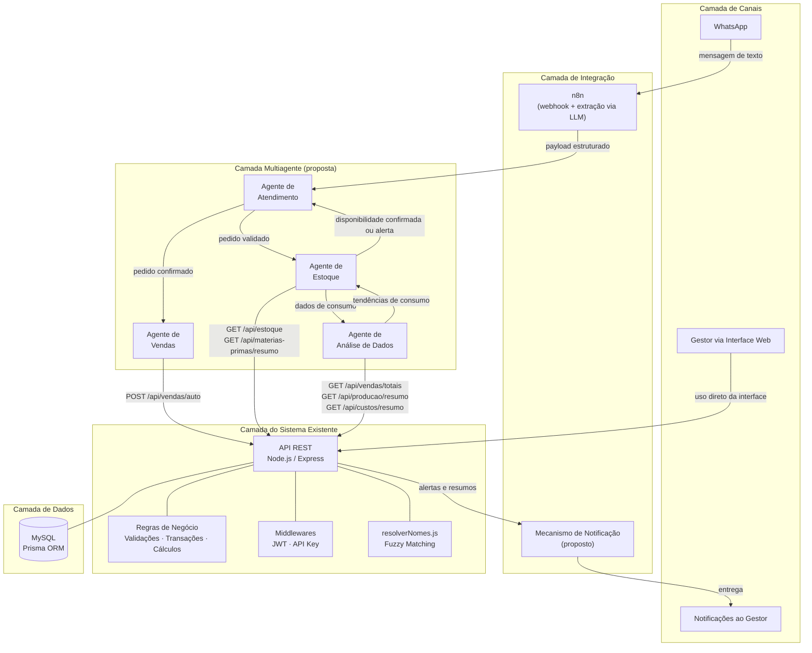
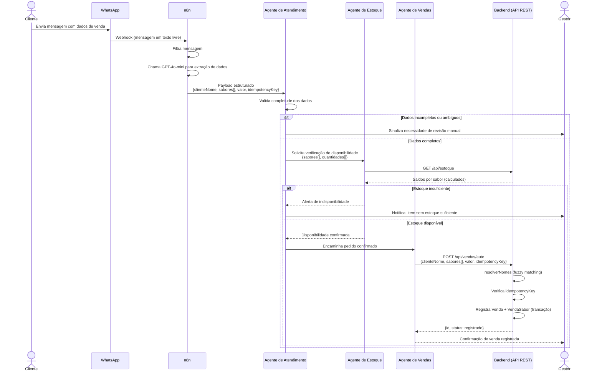

# Análise Técnica da Arquitetura Multiagente Proposta

**Projeto:** Doces da Maloca — Sistema de Gestão  
**Documento:** Material de apoio para a seção "Arquitetura Multiagente Proposta" do TCC  
**Data:** Junho de 2026  
**Versão:** 1.0

---

## 1. Objetivo do Documento

Este documento consolida a análise técnica do sistema atual do Doces da Maloca e propõe uma arquitetura multiagente viável para o TCC intitulado *"Desenvolvimento e avaliação de uma Plataforma Inteligente de Gestão para pequenos negócios baseada em sistemas multiagentes"*.

O objetivo não é escrever a seção acadêmica, mas fornecer uma base técnica precisa para isso: identificar o que existe de fato no repositório, o que está parcialmente preparado, o que é proposto e o que fica fora do escopo do trabalho. Todas as afirmações aqui presentes são fundamentadas no código-fonte, nos endpoints documentados e nos modelos de dados verificados diretamente no repositório.

O documento serve para:

- orientar a escrita da seção de arquitetura do TCC sem incorrer em imprecisões técnicas;
- registrar os pontos de integração entre a camada multiagente proposta e o sistema existente;
- delimitar o escopo realista de implementação para o TCC 2;
- listar os cuidados que devem ser observados na redação acadêmica.

---

## 2. Contexto do Sistema Atual

O Doces da Maloca já dispõe de um sistema de gestão próprio, desenvolvido para centralizar as operações do negócio em uma única aplicação web. O sistema foi construído como um monorepo contendo frontend, backend e configurações de automação no mesmo repositório.

### Tecnologias principais

| Camada | Tecnologia |
|---|---|
| Frontend | React 19, Vite, React Router DOM, Axios |
| Backend | Node.js, Express 4, Prisma ORM 5, MySQL |
| Autenticação | JWT (jsonwebtoken) para o frontend; API Key para automação via n8n |
| Automação | n8n (workflow exportado em JSON, não operacional em produção) |

### Módulos implementados

O sistema cobre os seguintes módulos operacionais, todos funcionais:

- **Clientes:** cadastro, listagem, estatísticas de compra, ranking de sabores por cliente.
- **Sabores:** cadastro com preço unitário e status ativo/inativo, receitas de produção vinculadas.
- **Vendas:** registro manual com seleção de cliente, sabores e quantidades; cálculo automático de valor; suporte a desconto.
- **Produção:** registro de lotes com verificação de estoque de matérias-primas e geração automática de movimentações de saída.
- **Estoque:** visão consolidada por sabor, calculada a partir do histórico de operações.
- **Matérias-primas:** cadastro, movimentações de entrada e saída, resumo de saldos com indicadores de alerta visual.
- **Custos:** registro de despesas com vínculo opcional a matérias-primas, gerando movimentações de entrada no estoque.
- **Relatórios e dashboard:** totais mensais e anuais, relatório dos últimos 12 meses, análise de sabores por cliente.

### Workflow n8n

O repositório inclui um workflow desenvolvido com a ferramenta n8n, localizado em `n8n/doces-maloca-vendas.json`, voltado para integração com o WhatsApp. O workflow está estruturado e documentado, mas **não está em operação em produção**. Trata-se de um artefato preparatório que representa uma base técnica para automação futura. Ele não deve ser descrito no TCC como funcionalidade em uso.

---

## 3. Diagnóstico Técnico do Repositório

### 3.1 Estrutura do monorepo

```
controle-vendas-doces-maloca-frontend/
├── backend/
│   ├── src/
│   │   ├── controllers/    (8 controllers)
│   │   ├── routes/         (8 arquivos de rotas)
│   │   ├── middlewares/    (auth.js, apiKeyAuth.js, validations.js)
│   │   ├── services/       (resolverNomes.js)
│   │   └── server.js
│   ├── prisma/
│   │   └── schema.prisma   (11 modelos)
│   └── tests/
│       └── api.test.js     (script de teste manual)
├── frontend/
│   └── src/
│       ├── pages/          (Login.jsx, Dashboard.jsx)
│       ├── components/     (11 componentes)
│       ├── context/        (AuthContext, ThemeContext)
│       ├── hooks/          (usePWA.js)
│       └── services/
│           └── api.js      (cliente Axios com todos os endpoints)
├── n8n/
│   └── doces-maloca-vendas.json
└── docs/
```

### 3.2 Arquitetura do backend

O backend segue o padrão MVC convencional. Há separação clara entre controllers (lógica de negócio), routes (definição de endpoints) e middlewares (autenticação e validação). Existe um único serviço reutilizável: `resolverNomes.js`, que implementa fuzzy matching para resolver clientes e sabores a partir de texto livre.

Dois mecanismos de autenticação coexistem:

- **JWT** (`middleware/auth.js`): usado pelo frontend; token com validade de 7 dias.
- **API Key** (`middleware/apiKeyAuth.js`): usado exclusivamente pelo endpoint `POST /api/vendas/auto`, que é o ponto de entrada designado para automação externa.

### 3.3 Arquitetura do frontend

O frontend é uma SPA (Single Page Application) com suporte a PWA. Toda a comunicação com o backend está centralizada no arquivo `frontend/src/services/api.js`, que agrupa os chamados de cada domínio em objetos separados (`vendasAPI`, `estoqueAPI`, etc.) com interceptadores Axios para injeção automática do token JWT.

### 3.4 Workflow n8n

O workflow existente em `n8n/doces-maloca-vendas.json` implementa o seguinte fluxo:

1. Recebe mensagem via webhook do WhatsApp.
2. Filtra mensagens que contenham dados de venda.
3. Envia o texto para a API da OpenAI (GPT-4o-mini) com prompt estruturado para extração de dados.
4. Processa a resposta JSON retornada pelo modelo.
5. Chama `POST /api/vendas/auto` com o payload extraído.

O workflow representa uma prova de conceito funcional para integração com WhatsApp. No contexto da arquitetura multiagente proposta, ele ocupará o papel de canal de entrada, não de agente.

### 3.5 Endpoint POST /api/vendas/auto

Este é o ponto de entrada mais relevante para a integração com agentes. Suas características:

- Autenticação por API Key (não requer token JWT).
- Aceita `clienteNome` como string (não como ID), resolvendo o cliente via fuzzy matching.
- Aceita `sabores[]` com nomes em texto livre, também resolvidos por fuzzy matching.
- Usa `idempotencyKey` para evitar registro duplicado de um mesmo pedido.
- Retorna erros descritivos quando cliente ou sabor não são encontrados, com sugestões de nomes próximos.

Payload esperado:

```json
{
  "clienteNome": "Frutaria Laranjeiras",
  "sabores": [
    { "nome": "Tradicional", "quantidade": 20 }
  ],
  "valor": 150.00,
  "desconto": 0,
  "idempotencyKey": "chave-unica-para-idempotencia"
}
```

### 3.6 Serviço resolverNomes.js

O serviço `backend/src/services/resolverNomes.js` normaliza strings (remove acentos, converte para minúsculas) e busca correspondência por similaridade entre o nome recebido e os registros cadastrados no banco. Ele é chamado internamente pelo endpoint `POST /api/vendas/auto` e pode ser reutilizado por agentes que precisem resolver nomes de clientes ou sabores a partir de texto não estruturado.

### 3.7 Funcionamento real do estoque

Este ponto é crítico para a arquitetura. **Não existe campo de saldo persistido no banco de dados.**

- **Estoque de doces:** calculado dinamicamente como `total produzido - total vendido` por sabor, a partir das tabelas `ProducaoSabor` e `VendaSabor`.
- **Estoque de matérias-primas:** calculado a partir do histórico de movimentações em `MovimentacaoMateriaPrima`, somando entradas (tipo `ENTRADA`, originadas de `Custo`) e subtraindo saídas (tipo `SAIDA`, originadas de `Producao`).

A vantagem dessa abordagem é a consistência dos dados: o saldo sempre reflete o histórico completo de operações. A limitação é que toda consulta de estoque exige agregação sobre todas as movimentações registradas, o que pode se tornar lento conforme o volume de dados cresce.

### 3.8 Ausências relevantes

As seguintes funcionalidades não existem no sistema atual e são relevantes para a arquitetura proposta:

| Ausência | Impacto na arquitetura |
|---|---|
| Sistema de notificação proativa (push, e-mail, webhook de saída) | Alertas do Agente de Estoque não têm como chegar ao gestor fora da interface |
| Campo de limiar mínimo configurável por sabor ou matéria-prima | O Agente de Estoque precisa de um parâmetro externo para determinar o que é crítico |
| Endpoint dedicado a alertas de estoque | O agente precisaria calcular internamente ou filtrar os resultados de `/estoque` |
| Endpoint para sugestão de produção | Não existe lógica de estimativa de demanda no sistema atual |
| Endpoint para custos não vinculados a insumos | Não existe filtro específico para isso na API |
| Framework de testes automatizados | O arquivo `tests/api.test.js` é um script de teste manual, não um framework como Jest ou Mocha |

---

## 4. Mapeamento de Módulos, Endpoints e Modelos

| Área do sistema | Arquivos/módulos principais | Endpoints relevantes | Modelos Prisma | Uso possível pelos agentes | Situação |
|---|---|---|---|---|---|
| **Vendas** | `vendasController.js`, `vendasRoutes.js` | `POST /api/vendas/auto`, `POST /api/vendas`, `GET /api/vendas/totais`, `GET /api/vendas/relatorio-mensal` | `Venda`, `VendaSabor` | Agente de Vendas: registrar venda via auto; Agente de Análise: consultar histórico e totais | Existente |
| **Estoque de doces** | `estoqueController.js`, `estoqueRoutes.js` | `GET /api/estoque` | `ProducaoSabor`, `VendaSabor` (calculado) | Agente de Estoque: consultar saldo por sabor; verificar disponibilidade antes de confirmar venda | Existente |
| **Matérias-primas** | `materiasPrimasController.js`, `materiasPrimasRoutes.js` | `GET /api/materias-primas/resumo`, `GET /api/materias-primas` | `MateriaPrima`, `MovimentacaoMateriaPrima` | Agente de Estoque: monitorar saldos e identificar itens críticos | Existente |
| **Produção** | `producaoController.js`, `producaoRoutes.js` | `GET /api/producao/resumo`, `GET /api/producao`, `POST /api/producao` | `Producao`, `ProducaoSabor` | Agente de Estoque e Análise: consultar histórico de produção; apoio a sugestão de volumes | Existente |
| **Custos** | `custosController.js`, `custosRoutes.js` | `GET /api/custos/resumo`, `GET /api/custos` | `Custo`, `MovimentacaoMateriaPrima` | Agente de Análise: consolidar custos; Agente de Estoque: detectar entradas sem vínculo a insumos | Existente |
| **Clientes** | `clientesController.js`, `clientesRoutes.js` | `GET /api/clientes`, `GET /api/clientes/:id/estatisticas`, `GET /api/clientes/ranking-sabores` | `Cliente`, `Venda` | Agente de Atendimento: resolver nome de cliente; Análise: ranking e frequência de compras | Existente |
| **Sabores** | `saboresController.js`, `saboresRoutes.js` | `GET /api/sabores`, `GET /api/sabores/:id/receita` | `Sabor`, `ReceitaItem` | Agente de Atendimento: resolver nome de sabor; Estoque: verificar receita para calcular necessidade de produção | Existente |
| **Relatórios/Dashboard** | `Dashboard.jsx`, `vendasController.js`, `producaoController.js`, `custosController.js` | `GET /api/vendas/totais`, `GET /api/vendas/relatorio-mensal`, `GET /api/producao/resumo`, `GET /api/custos/resumo` | Múltiplos | Agente de Análise: base para consolidação gerencial periódica | Existente |
| **Fuzzy matching** | `resolverNomes.js` | (serviço interno, chamado por `/api/vendas/auto`) | `Cliente`, `Sabor` | Reutilizável pelo Agente de Atendimento para resolução de nomes recebidos em texto livre | Existente |
| **Autenticação** | `authController.js`, `apiKeyAuth.js`, `auth.js` | `POST /api/auth/login`, `GET /api/auth/verificar` | `Usuario` | Agentes usam API Key (já suportado); não devem interferir no fluxo de autenticação do frontend | Existente |
| **Workflow n8n** | `n8n/doces-maloca-vendas.json` | (webhook externo, fora da API REST) | N/A | Canal de entrada para o Agente de Atendimento via WhatsApp; não substitui os agentes nem contém lógica de negócio | Parcialmente existente (não está em produção) |
| **Alertas de estoque** | — | `GET /api/estoque/alertas` (a criar) | `ProducaoSabor`, `VendaSabor`, `MateriaPrima` | Agente de Estoque: obter lista de itens abaixo do limiar sem processar todos os saldos | Proposto |
| **Custos sem vínculo** | — | `GET /api/custos/nao-vinculados` (a criar) | `Custo` | Agente de Estoque: identificar compras que não atualizaram o estoque de insumos | Proposto |
| **Notificação proativa** | — | (mecanismo a definir) | N/A | Entrega de alertas e resumos ao gestor fora da interface web | Proposto |

---

## 5. Arquitetura Multiagente Proposta

A arquitetura é organizada em cinco camadas com responsabilidades distintas e fronteiras bem definidas.

### 5.1 Camada de Canais

Representa os pontos de origem e destino das interações com o sistema.

| Canal | Descrição | Direção |
|---|---|---|
| WhatsApp | Clientes e o próprio gestor podem enviar mensagens com dados de pedidos | Entrada |
| Interface Web (frontend React) | Canal principal de uso do sistema pelo gestor; não é afetado pela camada multiagente | Entrada e saída |
| Notificações proativas | Canal de retorno para alertas e resumos gerados pelos agentes (a definir: WhatsApp, painel dedicado ou log consultável) | Saída |

### 5.2 Camada de Integração

Responsável por receber entradas externas, estruturá-las e encaminhar aos agentes; e por entregar saídas dos agentes de volta ao gestor.

| Componente | Função | Situação |
|---|---|---|
| n8n (workflow existente) | Recebe webhook do WhatsApp, extrai dados via LLM (GPT-4o-mini), estrutura payload e encaminha ao Agente de Atendimento | Parcialmente existente (não em produção) |
| Endpoint `POST /api/vendas/auto` | Ponto de entrada da API para registro automatizado de vendas, com API Key e idempotência | Existente |
| Mecanismo de notificação de saída | Entrega alertas e resumos ao gestor fora da interface (ex: WhatsApp via n8n, webhook, log consultável) | Proposto |

O n8n **não é um agente** nesta arquitetura. Ele é um canal de integração que prepara e encaminha dados, sem conter lógica de negócio dos agentes.

### 5.3 Camada Multiagente

Composta por quatro agentes implementados como componentes de software em código (não como workflows do n8n). Cada agente tem responsabilidade bem definida, consome a API REST do sistema e não acessa o banco de dados diretamente, salvo em situações excepcionais onde o dado necessário não esteja disponível por nenhum endpoint.

| Agente | Função principal |
|---|---|
| Agente de Atendimento | Valida e estrutura pedidos recebidos por canais externos |
| Agente de Vendas | Registra vendas no sistema via API |
| Agente de Estoque | Monitora níveis de estoque e emite alertas |
| Agente de Análise de Dados | Consolida dados operacionais e gera resumos gerenciais |

A comunicação entre agentes no escopo deste TCC é síncrona e direta (chamadas de função), sem barramento de mensagens, o que é suficiente para validar o conceito e compatível com a infraestrutura disponível.

### 5.4 Camada do Sistema Existente

Corresponde ao backend já implementado, que permanece sem alterações estruturais.

| Componente | Descrição |
|---|---|
| Backend Node.js/Express | Servidor da API REST com todos os módulos operacionais |
| API REST (40+ endpoints) | Interface de integração entre os agentes e os dados do sistema |
| Regras de negócio | Validações, cálculos, transações e lógica de domínio permanecem no backend |
| Middleware JWT + API Key | Controle de acesso para frontend e para agentes, respectivamente |
| resolverNomes.js | Serviço de fuzzy matching reutilizável para resolução de nomes |
| Prisma ORM | Camada de acesso ao banco, mediando toda leitura e escrita de dados |

### 5.5 Camada de Dados

| Componente | Descrição |
|---|---|
| MySQL | Banco de dados relacional com 11 modelos de dados |
| Prisma ORM | Garante consistência nas operações de leitura e escrita; acesso direto pelos agentes deve ser evitado |

Os agentes **não devem acessar o banco de dados diretamente** como regra geral. Toda leitura e escrita deve passar pela API REST, preservando as validações e transações já implementadas no backend. O acesso direto ao banco seria admitido apenas em situações excepcionais, devidamente documentadas, onde o dado necessário não esteja disponível por nenhum endpoint e não justifique a criação de um novo endpoint naquele momento.

---

## 6. Princípios Arquiteturais

Os princípios a seguir orientam as decisões de projeto da camada multiagente e devem ser mencionados na seção acadêmica para justificar as escolhas feitas.

**1. Os agentes complementam o sistema existente, não o substituem.**  
A proposta parte do sistema funcional já em uso e adiciona uma camada de automação. Nenhum módulo existente é removido ou reescrito.

**2. A API REST é a fronteira principal de integração.**  
Toda comunicação entre a camada multiagente e o sistema existente ocorre via endpoints REST já disponíveis ou a serem criados. Isso preserva o encapsulamento das regras de negócio.

**3. O acesso direto ao banco deve ser evitado.**  
Acesso direto pelos agentes contornaria validações, transações e regras de negócio implementadas no backend, criando risco de inconsistência nos dados. A API é a interface correta.

**4. As regras de negócio permanecem no backend.**  
Validações de campos, cálculos de valor, verificações de estoque de matérias-primas antes de registrar produção e geração de movimentações são responsabilidades do backend. Os agentes não devem reimplementar essa lógica.

**5. O n8n é canal de integração, não agente.**  
O n8n recebe mensagens externas, extrai dados com auxílio de LLM e encaminha ao sistema. Ele não toma decisões de negócio, não valida pedidos e não executa ações no banco.

**6. A comunicação entre agentes será síncrona e simples no escopo do TCC.**  
Não há barramento de mensagens, filas ou eventos assíncronos no escopo deste trabalho. A coordenação entre agentes é implementada por chamadas de função diretas, o que é suficiente para o volume e complexidade do negócio estudado.

**7. A automação deve preservar a possibilidade de revisão manual pelo gestor.**  
Nenhum agente deve executar ações irreversíveis de alto impacto sem a possibilidade de revisão humana. Em particular, o Agente de Estoque sugere produção, mas não a executa. O gestor mantém controle sobre decisões críticas.

**8. A arquitetura não deve prometer predição robusta sem dados suficientes.**  
Análises preditivas confiáveis requerem volume histórico representativo. No escopo do TCC, o Agente de Análise produz resumos e indicadores simples. Estimativas baseadas em tendências devem ser apresentadas como indicativas, não como previsões.

---

## 7. Descrição dos Agentes

### 7.1 Agente de Atendimento

| Atributo | Descrição |
|---|---|
| **Objetivo** | Processar pedidos recebidos por canais externos, validar a completude dos dados e estruturá-los em formato compatível com o sistema |
| **Entradas** | Payload vindo do n8n: `clienteNome` (string), `sabores[]` (nome + quantidade), `valor`, `desconto`, `idempotencyKey` |
| **Saídas** | Pedido validado encaminhado ao Agente de Estoque (verificação de disponibilidade) e ao Agente de Vendas (registro); ou sinalização de revisão manual quando os dados forem insuficientes |
| **Responsabilidades** | Verificar se todos os campos obrigatórios estão presentes; apoiar-se nos retornos do backend e nas validações prévias de clientes e sabores para identificar dados inconsistentes ou não encontrados; solicitar revisão manual quando o pedido não puder ser processado automaticamente |
| **Dados consultados** | `GET /api/clientes` e `GET /api/sabores` (para validação prévia); a resolução de nomes por similaridade ocorre internamente no backend ao processar o endpoint `POST /api/vendas/auto` |
| **Ações executadas** | Encaminhamento interno ao Agente de Vendas (não registra venda diretamente) |
| **Integrações necessárias** | n8n como canal de entrada (webhook); endpoint `POST /api/vendas/auto` como destino final do fluxo |
| **Dependências** | Serviço `resolverNomes.js` presente no backend e acionado internamente pelo endpoint `POST /api/vendas/auto`; base de clientes e sabores previamente cadastrada pelo gestor |
| **Riscos e limitações** | Se o cliente ou sabor não estiver cadastrado, o agente não pode criar o registro automaticamente; a qualidade da extração pelo LLM no n8n determina diretamente a qualidade do pedido recebido; mensagens ambíguas ou com ortografia muito distante dos cadastros podem gerar falhas na resolução de nomes |
| **Prioridade** | Alta |

---

### 7.2 Agente de Vendas

| Atributo | Descrição |
|---|---|
| **Objetivo** | Receber o pedido validado e registrar a venda no sistema via API, respeitando as regras de negócio já implementadas no backend |
| **Entradas** | Pedido estruturado do Agente de Atendimento: `clienteNome`, `sabores[]` com quantidades, `valor`, `desconto`, `idempotencyKey` |
| **Saídas** | Confirmação de venda registrada (com ID e dados) ou retorno de erro com motivo; os efeitos da venda passam a ser considerados nos cálculos posteriores de estoque realizados pelo backend |
| **Responsabilidades** | Chamar `POST /api/vendas/auto` com os dados recebidos; interpretar a resposta do backend; retornar status de sucesso ou erro ao fluxo |
| **Dados consultados** | Resultado da chamada à API (não consulta dados adicionais) |
| **Ações executadas** | `POST /api/vendas/auto` — único endpoint adequado para automação, com suporte a API Key e idempotência |
| **Integrações necessárias** | Endpoint `POST /api/vendas/auto` já existente; API Key configurada no backend |
| **Dependências** | Agente de Atendimento (entrega o pedido estruturado); preferencialmente, confirmação do Agente de Estoque antes do registro |
| **Riscos e limitações** | O endpoint `POST /api/vendas/auto` não verifica disponibilidade de estoque de doces antes do registro — isso é responsabilidade do Agente de Estoque em etapa anterior; se o Agente de Estoque não for consultado antes, é possível registrar uma venda de item com saldo zero |
| **Prioridade** | Alta |

---

### 7.3 Agente de Estoque

| Atributo | Descrição |
|---|---|
| **Objetivo** | Monitorar continuamente os níveis de estoque de doces e matérias-primas, verificar disponibilidade antes de confirmações de venda, emitir alertas quando itens atingem níveis críticos e apoiar sugestões de produção |
| **Entradas** | Consultas periódicas à API; solicitação de verificação de disponibilidade vinda do Agente de Atendimento; parâmetros de limiares mínimos configurados externamente |
| **Saídas** | Confirmação ou negação de disponibilidade (para o fluxo de venda); alertas de itens com saldo crítico ou zerado; identificação de custos sem vínculo a insumos; dados de consumo para o Agente de Análise |
| **Responsabilidades** | Consultar `GET /api/estoque` e `GET /api/materias-primas/resumo` em intervalos regulares; comparar saldos com limiares configurados; gerar alertas quando itens estiverem abaixo do mínimo; identificar registros de custo sem `materiaPrimaId` (endpoint a criar) |
| **Dados consultados** | `GET /api/estoque`, `GET /api/materias-primas/resumo`, `GET /api/producao/resumo`, `GET /api/custos` (com filtro para itens sem vínculo) |
| **Ações executadas** | Apenas leitura e emissão de alertas; o agente **não executa produção automaticamente** e **não registra dados** no sistema |
| **Integrações necessárias** | Mecanismo de notificação de saída (ainda não existe; precisa ser criado ou integrado via n8n); configuração de limiares mínimos por item (não existe no banco atual) |
| **Dependências** | Limiares mínimos definidos externamente; Agente de Análise para apoio às sugestões de produção |
| **Riscos e limitações** | Sem limiares mínimos configurados, o agente só consegue detectar itens zerados ou negativos; o cálculo de estoque por histórico pode ser lento com volume crescente; o agente não deve registrar produção, pois isso afeta o consumo de matérias-primas e exige decisão do gestor |
| **Prioridade** | Alta |

---

### 7.4 Agente de Análise de Dados

| Atributo | Descrição |
|---|---|
| **Objetivo** | Consolidar periodicamente os dados operacionais disponíveis e apresentar ao gestor informações resumidas sobre desempenho de vendas, tendências simples de consumo, custos e estoque, sem depender de consulta manual |
| **Entradas** | Dados consultados via API: histórico de vendas, produção, custos, estoque e clientes |
| **Saídas** | Resumo gerencial periódico: sabores mais vendidos, variação de receita, custos do período, saldo de estoque por sabor, clientes com maior volume; o formato de entrega depende do mecanismo de notificação disponível |
| **Responsabilidades** | Consolidar dados de diferentes endpoints em uma visão integrada; calcular indicadores básicos (ex: média de vendas por sabor, variação de receita mês a mês); apoiar o Agente de Estoque com estimativas de consumo baseadas em histórico recente |
| **Dados consultados** | `GET /api/vendas/totais`, `GET /api/vendas/relatorio-mensal`, `GET /api/producao/resumo`, `GET /api/custos/resumo`, `GET /api/estoque`, `GET /api/clientes/ranking-sabores` |
| **Ações executadas** | Apenas leitura e consolidação; nenhuma ação de escrita |
| **Integrações necessárias** | Mecanismo de entrega do resumo ao gestor (painel dedicado ou notificação) |
| **Dependências** | Qualidade e consistência dos dados gerados pelos demais módulos; volume de dados: com menos de 30 dias de histórico, os padrões identificados não são representativos |
| **Riscos e limitações** | Análises preditivas robustas estão fora do escopo viável; o agente depende do uso regular do sistema para ter dados de qualidade; resultados devem ser apresentados como indicativos, não como previsões |
| **Prioridade** | Média |

---

## 8. Fluxos Operacionais Propostos

### 8.1 Fluxo 1: Pedido vindo do WhatsApp

1. O cliente envia uma mensagem de texto no WhatsApp com dados de uma venda (ex.: "20 caixas de brigadeiro para a Frutaria Laranjeiras, 150 reais").
2. O webhook do n8n recebe a mensagem.
3. O n8n filtra a mensagem para verificar se contém dados de venda.
4. O n8n envia o texto para a API da OpenAI (GPT-4o-mini) com prompt estruturado para extração de dados em JSON.
5. O n8n processa a resposta e monta o payload: `{ clienteNome, sabores[], valor, desconto, idempotencyKey }`.
6. O n8n encaminha o payload ao **Agente de Atendimento**.
7. O Agente de Atendimento valida a completude dos dados.
   - Se dados faltarem ou forem ambíguos: sinaliza ao gestor para revisão manual.
   - Se dados estiverem completos: encaminha ao Agente de Estoque.
8. O **Agente de Estoque** consulta `GET /api/estoque` e verifica se os sabores solicitados têm saldo disponível.
   - Se algum item estiver indisponível: retorna alerta ao Agente de Atendimento, que notifica o gestor.
   - Se disponível: confirma disponibilidade e encaminha ao Agente de Vendas.
9. O **Agente de Vendas** executa `POST /api/vendas/auto` com o payload estruturado.
10. O backend usa `resolverNomes.js` para localizar cliente e sabores por nome, verifica a `idempotencyKey` para evitar duplicata e registra `Venda` + `VendaSabor` em uma única transação.
11. O backend retorna confirmação com ID da venda e dados registrados.
12. O resultado é encaminhado ao gestor via mecanismo de notificação (a definir).

> **Nota sobre o escopo do TCC:** O passo 6 pode ser simplificado, com o n8n chamando diretamente o endpoint `POST /api/vendas/auto` existente para validar o fluxo técnico antes de introduzir a camada de agentes completa.

---

### 8.2 Fluxo 2: Monitoramento Proativo de Estoque

1. O **Agente de Estoque** executa consulta periódica (ex.: a cada hora ou diariamente, conforme configuração).
2. O agente consulta `GET /api/estoque`, obtendo saldo por sabor (calculado: produzido - vendido).
3. O agente consulta `GET /api/materias-primas/resumo`, obtendo saldos e flags de alerta (`baixo`, `negativo`).
4. O agente compara saldos com limiares mínimos configurados externamente.
   - Itens com saldo igual a zero ou negativo: marcados como **críticos**.
   - Itens abaixo do limiar mínimo: marcados como **atenção**.
5. Se houver itens em estado crítico ou de atenção:
   - O agente gera registro de alerta com: item, saldo atual, limiar configurado, data e hora.
   - O alerta é encaminhado ao gestor via mecanismo de notificação.
6. O agente verifica também registros de custo sem `materiaPrimaId` (via endpoint a criar: `GET /api/custos/nao-vinculados`).
   - Se houver: sinaliza como possível inconsistência no saldo de matérias-primas.

---

### 8.3 Fluxo 3: Apoio à Decisão de Produção

1. O **Agente de Estoque** consulta `GET /api/estoque` e identifica sabores com saldo abaixo de um limiar ou zerados.
2. O **Agente de Análise de Dados** consulta `GET /api/vendas/totais` e `GET /api/vendas/relatorio-mensal` com filtro dos últimos 30 dias.
3. O Agente de Análise calcula a média de vendas diária por sabor no período consultado.
4. O Agente de Estoque combina saldo atual com média de consumo para estimar cobertura em dias: `saldo_atual / media_diaria`.
5. Para sabores com cobertura estimada abaixo de um limiar configurado (ex.: menos de 7 dias), o agente inclui na sugestão de produção.
6. O sistema apresenta ao gestor a sugestão com: sabor, saldo atual, média de consumo e quantidade sugerida.
7. O gestor decide se executa e em que quantidade. A produção não é executada automaticamente.

> **Nota sobre o escopo do TCC:** Este fluxo tem caráter exploratório. A confiabilidade da sugestão depende do volume de dados históricos disponível — com menos de 30 dias de registro, as estimativas são pouco representativas. O endpoint `GET /api/estoque/sugestao-producao` ainda não existe e sua criação deve ser tratada como evolução futura. No TCC 2, este fluxo pode ser descrito como possibilidade futura, sem ser apresentado como funcionalidade central da entrega.

---

### 8.4 Fluxo 4: Análise Gerencial Periódica

1. O **Agente de Análise de Dados** executa consolidação periódica (ex.: semanal ou mensal).
2. O agente consulta os seguintes endpoints com filtros de período:
   - `GET /api/vendas/totais`
   - `GET /api/vendas/relatorio-mensal`
   - `GET /api/producao/resumo`
   - `GET /api/custos/resumo`
   - `GET /api/estoque`
   - `GET /api/clientes/ranking-sabores`
3. O agente consolida os dados em um resumo estruturado:
   - Total de vendas e número de pedidos no período.
   - Sabores mais vendidos e variação em relação ao período anterior.
   - Custos do período por categoria.
   - Saldo atual de estoque por sabor.
   - Clientes com maior volume de compra.
   - Indicadores simples: média por venda, variação de receita.
4. O resumo é entregue ao gestor via painel dedicado ou notificação.
5. O gestor consulta o resumo para apoiar decisões de produção, compra e atendimento.

---

## 9. Pontos de Integração com o Sistema Existente

| Agente | Endpoint | Tipo | Dados envolvidos | Situação | Observação técnica |
|---|---|---|---|---|---|
| Atendimento | `GET /api/clientes` | Leitura | Lista de clientes cadastrados | Existente | Usado para validação prévia; resolução de nome ocorre no backend via `resolverNomes.js` |
| Atendimento | `GET /api/sabores` | Leitura | Lista de sabores ativos | Existente | Mesmo propósito de validação prévia |
| Vendas | `POST /api/vendas/auto` | Escrita | `clienteNome`, `sabores[]`, `valor`, `desconto`, `idempotencyKey` | Existente | Endpoint principal para automação; usa API Key e fuzzy matching interno |
| Estoque | `GET /api/estoque` | Leitura | Saldo por sabor (calculado por histórico) | Existente | Saldo não é persistido; toda consulta agrega histórico completo |
| Estoque | `GET /api/materias-primas/resumo` | Leitura | Saldo de insumos com flags `baixo` e `negativo` | Existente | Flags de alerta já calculadas pelo backend |
| Estoque | `GET /api/producao/resumo` | Leitura | Totais de produção por sabor e período | Existente | Útil para estimar ritmo de produção |
| Estoque | `GET /api/estoque/alertas` | Leitura | Itens com saldo abaixo do limiar | A criar | Evita que o agente processe todos os saldos para filtrar os críticos |
| Estoque | `GET /api/custos/nao-vinculados` | Leitura | Custos sem `materiaPrimaId` | A criar | Permite detectar compras que não atualizaram o estoque de insumos |
| Análise | `GET /api/vendas/totais` | Leitura | Totais agregados com filtros de período | Existente | Suporta filtros por mês, ano, cliente |
| Análise | `GET /api/vendas/relatorio-mensal` | Leitura | Série histórica dos 12 meses | Existente | Base para análise de tendências simples |
| Análise | `GET /api/producao/resumo` | Leitura | Dados de produção comparativos | Existente | Inclui comparação com vendido |
| Análise | `GET /api/custos/resumo` | Leitura | Custos por categoria e mês | Existente | Série histórica de 12 meses |
| Análise | `GET /api/clientes/ranking-sabores` | Leitura | Preferências de sabores por cliente | Existente | Útil para identificar padrões de consumo |
| Análise + Estoque | `GET /api/estoque/sugestao-producao` | Leitura | Estimativa de necessidade de produção | A criar (caráter exploratório) | Combina histórico de vendas e saldo atual; resultado deve ser tratado como indicativo |

---

## 10. Endpoints ou Ajustes Recomendados

### Essenciais

| Endpoint/Ajuste | Justificativa |
|---|---|
| Configuração de limiares mínimos por item | Sem limiares, o Agente de Estoque só detecta itens zerados; a configuração pode ser um arquivo externo ou um campo novo no banco (ex.: `limiarMinimo` em `Sabor` e `MateriaPrima`) |
| Mecanismo de notificação de saída | Sem isso, alertas do Agente de Estoque ficam presos na camada dos agentes, sem chegar ao gestor; pode ser implementado via webhook de saída para o n8n, que entrega via WhatsApp |
| `GET /api/estoque/alertas` | Retorna apenas os itens com saldo abaixo do limiar, evitando que o agente processe a lista completa de saldos; pode ser criado com poucas linhas no backend |

### Desejáveis

| Endpoint/Ajuste | Justificativa |
|---|---|
| `GET /api/materias-primas/alertas` | Análogo ao de estoque de doces; o endpoint `/materias-primas/resumo` já retorna flags de alerta, mas um endpoint dedicado facilitaria o consumo pelo agente |
| `GET /api/custos/nao-vinculados` | Permite ao Agente de Estoque identificar compras que passaram pelo controle financeiro sem atualizar o saldo de insumos |

### Evolução futura

| Endpoint/Ajuste | Justificativa |
|---|---|
| `GET /api/estoque/sugestao-producao` | Combina histórico de vendas e saldo atual para estimar necessidade de produção; requer volume de dados suficiente e deve ser tratado como indicativo; viável como evolução após validação dos agentes básicos |

---

## 11. Escopo Recomendado para o TCC 2

### 11.1 Essencial para implementar

| Funcionalidade | Justificativa |
|---|---|
| Agente de Atendimento: validação e estruturação de pedido recebido do n8n | O serviço `resolverNomes.js` já existe; o fluxo técnico está mapeado; é o ponto de entrada do sistema multiagente |
| Agente de Vendas: registro via `POST /api/vendas/auto` | Endpoint já existe com suporte a API Key e idempotência; é o fluxo de automação mais direto |
| Agente de Estoque: consulta periódica e detecção de itens críticos | Endpoints já existem; lógica de comparação com limiares é simples |
| Integração n8n como canal de entrada (WhatsApp) | Workflow já existe e está estruturado; precisa ser colocado em operação no ambiente de produção |
| Configuração de limiares mínimos | Necessária para o funcionamento útil do Agente de Estoque; pode ser implementada como arquivo de configuração ou campo no banco |
| Retorno ao gestor | Confirmação ou alerta deve chegar ao gestor; a forma mais simples é via n8n entregando mensagem no WhatsApp |

### 11.2 Desejável, se houver tempo

| Funcionalidade | Justificativa |
|---|---|
| Agente de Análise de Dados: consolidação periódica básica | Os endpoints necessários já existem; implementação é simples; agrega valor sem grande complexidade |
| Alertas de matérias-primas com endpoint dedicado | Melhora a eficiência do Agente de Estoque no monitoramento de insumos |
| Detecção de custos sem vínculo a insumos | Identifica inconsistências no saldo de matérias-primas; requer endpoint simples a criar |

### 11.3 Fora do escopo ou evolução futura

| Funcionalidade | Justificativa |
|---|---|
| Análise preditiva com modelos de aprendizado de máquina | Requer volume de dados e infraestrutura não disponíveis no contexto do TCC |
| Sugestão automatizada de produção baseada em histórico | Depende de volume de dados suficiente para ser representativa e de endpoint ainda não existente; deve ser tratada como funcionalidade exploratória ou evolução pós-TCC |
| Execução automática de produção pelo agente | Afeta diretamente o estoque de matérias-primas; exige confirmação do gestor; risco operacional alto |
| Cadastro automático de clientes ou sabores | Risco de poluir a base de dados com registros incorretos; requer curadoria humana |
| Barramento de mensagens (Kafka, RabbitMQ) | Não justificado para o volume e contexto do negócio |
| Múltiplos canais de atendimento além do WhatsApp | Extrapola o escopo do TCC |
| Painel de monitoramento dos próprios agentes | Útil em produção, mas é uma camada adicional fora do escopo principal |
| Análise de sazonalidade com séries históricas longas | Requer histórico que pode não estar disponível no período do TCC |

---

## 12. Limitações e Riscos

**Dependência da qualidade dos dados cadastrados.**  
O Agente de Atendimento depende de clientes e sabores previamente cadastrados no sistema. Se um cliente novo enviar um pedido, o agente não conseguirá resolver o nome e precisará sinalizar ao gestor. A qualidade da base de dados é um pré-requisito para o funcionamento automático.

**Risco de erro na interpretação de mensagens pelo LLM.**  
A extração de dados por GPT-4o-mini no n8n pode falhar em mensagens ambíguas, com erros ortográficos graves ou em formatos não previstos no prompt. Pedidos com dados extraídos incorretamente chegam ao Agente de Atendimento como dados incorretos. O agente deve ser capaz de identificar inconsistências óbvias, mas não pode corrigir erros de interpretação do modelo.

**Necessidade de revisão manual.**  
Alguns pedidos não poderão ser processados automaticamente. O fluxo deve prever um caminho de saída claro para esses casos, com notificação ao gestor e possibilidade de registro manual pela interface existente.

**Ausência atual de notificações proativas.**  
O sistema não possui mecanismo para enviar alertas ao gestor fora da interface web. A implementação de notificações é um componente adicional que precisa ser criado ou integrado para que o Agente de Estoque seja útil na prática.

**Ausência de limiares mínimos no banco de dados.**  
Os modelos `Sabor` e `MateriaPrima` não possuem campo de limiar mínimo. Sem esse parâmetro, o Agente de Estoque só consegue detectar itens zerados ou negativos. A adição desse campo ou de uma configuração externa é necessária para que os alertas sejam significativos.

**Custo e disponibilidade da API de LLM.**  
O workflow n8n usa a API da OpenAI, que tem custo por uso. Em ambientes de produção, o volume de mensagens processadas impacta o custo operacional. No escopo do TCC, o volume é pequeno, mas isso deve ser mencionado como limitação de escala.

**Limitações do estoque calculado por histórico.**  
Toda consulta de estoque exige uma agregação sobre o histórico completo de movimentações. Com o crescimento do volume de dados ao longo do tempo, essa abordagem pode apresentar degradação de desempenho. No período do TCC, o volume de dados é pequeno e isso não deve ser um problema prático, mas é uma limitação arquitetural a registrar.

**Volume de dados insuficiente para estimativas representativas.**  
O Agente de Análise e o suporte à decisão de produção dependem de histórico consistente. Com poucas semanas de dados, as médias calculadas têm pouca representatividade estatística. Resultados devem ser apresentados como indicativos e o TCC deve reconhecer essa limitação.

**Risco de duplicidade mitigado por idempotencyKey.**  
O endpoint `POST /api/vendas/auto` implementa controle de idempotência: um pedido com a mesma `idempotencyKey` não é registrado duas vezes. No entanto, a geração correta e única dessa chave é responsabilidade do n8n, e sua ausência ou colisão pode causar comportamento inesperado.

---

## 13. Cuidados para a Escrita Acadêmica

As afirmações a seguir devem ser evitadas no TCC, pois não correspondem ao que foi verificado no repositório ou ao escopo do trabalho:

1. **Não afirmar que o workflow n8n está em produção.** O arquivo existe e está estruturado, mas não há evidência de que esteja operacional no ambiente de produção do negócio. O correto é descrever como "workflow preparatório" ou "artefato de integração desenvolvido e documentado, ainda não operacionalizado".

2. **Não afirmar que o estoque é atualizado em campo persistido.** O saldo de estoque é calculado dinamicamente a partir do histórico de operações. Não existe campo `saldo` persistido em nenhuma tabela do banco. Afirmar o contrário gera inconsistência verificável com o código.

3. **Não apresentar os agentes como já integrados ao sistema.** A integração é a proposta do TCC 2. No estado atual, o que existe é a preparação técnica: o endpoint `POST /api/vendas/auto`, o serviço `resolverNomes.js` e o workflow n8n. A camada multiagente ainda não está implementada.

4. **Não prometer análise preditiva robusta.** Análise por tendências simples é viável. Previsões baseadas em modelos estatísticos ou aprendizado de máquina não são viáveis no escopo e volume de dados deste negócio no período do TCC.

5. **Não apresentar o n8n como substituto da camada multiagente.** O n8n é um canal de entrada e eventualmente de saída. A lógica de negócio dos agentes deve estar em código, não em workflows visuais do n8n.

6. **Não afirmar que o Agente de Estoque escreve diretamente no banco.** O agente apenas consulta a API. Qualquer escrita é feita pelo backend, que preserva as regras de negócio e a integridade das transações.

7. **Não afirmar que já existe campo de limiar mínimo no banco.** Esse campo não existe nos modelos `Sabor` nem `MateriaPrima`. Se for utilizado na implementação, deve ser descrito como extensão proposta ou configuração externa adicionada no contexto do TCC.

8. **Não afirmar que a sugestão de produção é executada automaticamente.** O agente sugere; o gestor decide e executa via interface normal do sistema. A automação da produção está explicitamente fora do escopo.

9. **Não generalizar os resultados.** O trabalho é um estudo de caso em um microempreendimento específico. Os critérios de avaliação são descritivos e qualitativos. Os resultados dizem respeito ao caso estudado e não podem ser generalizados sem ressalvas.

10. **Não descrever o arquivo `tests/api.test.js` como suite de testes automatizados.** Trata-se de um script de teste manual executado via Node.js, não de um framework de testes automatizados como Jest ou Mocha.

---

## 14. Diagramas Mermaid

### 14.1 Arquitetura em Camadas



---

### 14.2 Fluxo de Pedido via WhatsApp



---

*Este documento foi gerado como material técnico de apoio ao TCC e deve ser revisado antes da escrita da seção acadêmica.*
