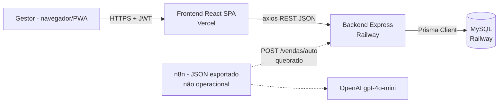
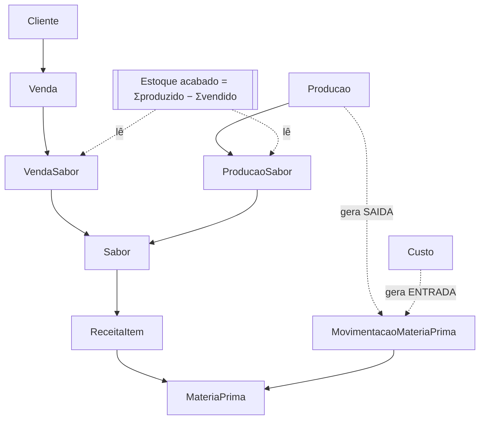
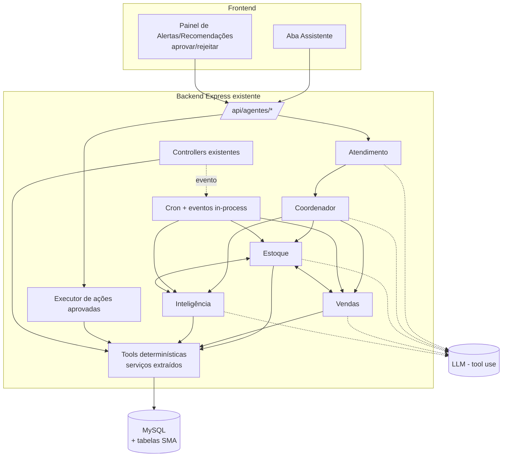

# Auditoria Técnica Inicial — Doces da Maloca

**Finalidade:** diagnóstico do repositório antes da implementação da camada de Sistemas Multiagentes (SMA) do TCC.
**Data:** 29/09/2026
**Commit analisado:** `500c762` (branch `main`, árvore limpa)
**Modo:** somente leitura. Nenhum arquivo de código, configuração ou dado foi alterado. O único arquivo criado é este relatório.

> Convenção: toda afirmação técnica relevante traz **Evidência** com caminho e, quando útil, linha (`arquivo:linha`). Onde algo não pôde ser verificado no código (ex.: volume de dados em produção), isso está marcado como **não verificado**.

---

## 1. Resumo executivo

O sistema é um **monorepo JavaScript** com backend **Express 4 + Prisma 5 + MySQL** (deploy no Railway) e frontend **React 19 + Vite 7** em PWA (deploy na Vercel). São 11 modelos de dados, 42 endpoints REST e 14 telas/abas cobrindo vendas, pagamento, clientes, sabores, receitas, produção, estoque de produto acabado (derivado), matéria-prima (por movimentações) e custos.

**O que ajuda o TCC:**
- O domínio é coeso e pequeno (≈3.300 linhas de backend/frontend relevantes), fácil de entender e estender.
- Já existem dados ricos para agentes: histórico de vendas por sabor e por cliente, **status de pagamento** (contas a receber), produção por sabor, **receitas (BOM)** com rendimento, e **livro de movimentações** de matéria-prima com rastreabilidade de origem.
- Já existe uma "semente" de automação: `POST /api/vendas/auto` com idempotência e resolução de nomes por texto.

**O que atrapalha:**
- **Não há camada de serviços.** Toda a regra de negócio está dentro dos controllers Express (acoplada a `req/res`). Um agente não consegue reutilizar "calcular estoque" ou "calcular necessidade de insumos" sem HTTP ou sem refatorar.
- **Não há ambiente de desenvolvimento/teste isolado** nem testes automatizados; o `start` de produção executa `prisma db push --accept-data-loss` a cada deploy.
- **O canal de automação existente não funciona como documentado:** `/api/vendas/auto` exige JWT **e** API Key (o middleware JWT é aplicado a todo `/api/vendas`), e o workflow n8n exportado não envia API Key, nem `idempotencyKey`, e aponta para uma URL sem `/api`.
- **Nada de infraestrutura assíncrona:** sem scheduler, fila, eventos, notificações, websockets ou log de auditoria.
- **O "Agente de Atendimento" não tem base no sistema real:** `Cliente` só tem `id` e `nome` (sem telefone/contato), não existe entidade de pedido nem canal com o cliente. Os clientes são, em sua maioria, revendedores B2B (frutarias, panificadoras).

**Recomendação de MVP (detalhada na seção 16):** uma camada de agentes **dentro do backend Node** (módulo `agents/`), apoiada numa **camada de ferramentas determinísticas** extraída dos controllers atuais. Três agentes especialistas (**Estoque**, **Vendas**, **Inteligência**) e um **Agente de Atendimento reinterpretado como interface conversacional do gestor**, sob um **Coordenador**. Execução por agendamento e sob demanda. O LLM só interpreta, planeja e redige. **Toda escrita passa por uma "ação proposta" que o gestor aprova** antes de ser executada pelo código existente.

---

## 2. Stack encontrada

| Camada | Tecnologia (versão declarada) | Evidência |
|---|---|---|
| Runtime | Node.js (ESM, `"type": "module"`); local: v24.15.0 | `backend/package.json:6` |
| Backend | Express `^4.21.1`, cors, dotenv | `backend/package.json` |
| ORM | Prisma `^5.22.0` (client + CLI) | `backend/package.json`, `npx prisma -v` → 5.22.0 |
| Banco | MySQL (`provider = "mysql"`) | `backend/prisma/schema.prisma:5-8` |
| Autenticação | JWT (`jsonwebtoken ^9`, expiração 7d) + bcrypt `^6`; API Key para `/vendas/auto` | `backend/src/controllers/authController.js:75-79`, `backend/src/middlewares/auth.js`, `backend/src/middlewares/apiKeyAuth.js` |
| Frontend | React `^19.2`, react-router-dom `^7.9`, axios `^1.7`, Vite `^7.2` | `frontend/package.json` |
| Lint | ESLint 9 (flat config) + react-hooks + react-refresh | `frontend/eslint.config.js` |
| PWA | `manifest.json` + Service Worker próprio (network-first para API, cache-first para estáticos) | `frontend/public/sw.js`, `frontend/src/hooks/usePWA.js` |
| Deploy backend | Railway (`doce-maloca-backend-production.up.railway.app`) | `frontend/.env.production` |
| Deploy frontend | Vercel (SPA rewrite) | `frontend/vercel.json`, `frontend/.vercel/` |
| Automação externa | n8n (JSON exportado) + OpenAI `gpt-4o-mini` via HTTP | `n8n/doces-maloca-vendas.json` |
| Testes | **Nenhum framework.** Um script manual de smoke test | `backend/tests/api.test.js` |

**Variáveis de ambiente usadas pelo backend** (não há `.env.example`): `DATABASE_URL`, `JWT_SECRET`, `N8N_API_KEY`, `PORT`.
Evidência: `grep process.env backend/src backend/prisma`; `backend/prisma/schema.prisma:7`.

**Não existe `backend/.env` local.** O único banco identificável é o de produção no Railway. Os `.env.local` da raiz e do frontend contêm apenas `VERCEL_OIDC_TOKEN`.

**Scripts disponíveis**

| Pacote | Script | O que faz |
|---|---|---|
| backend | `dev` | `nodemon src/server.js` |
| backend | `start` | `prisma generate && prisma db push --accept-data-loss && node src/server.js` ⚠️ |
| backend | `build` | `prisma generate && prisma db push --accept-data-loss` ⚠️ |
| backend | `postinstall` | `prisma generate` |
| backend | `backfill:pagamentos` | marca como pagas as vendas antigas (script de uso único) |
| frontend | `dev` / `build` / `preview` / `lint` | Vite / ESLint |

Evidência: `backend/package.json:7-13`, `frontend/package.json:6-11`.

---

## 3. Arquitetura atual

### 3.1 Visão macro



- **Monolito REST em camadas finas:** `routes → middlewares → controllers → Prisma`. Não há camada de serviço/repositório (a pasta `services/` tem um único arquivo utilitário).
- **Sem estado de servidor** além do banco: nenhum cache, fila, cron ou worker.
- **Usuário único** (sem papéis). Não há relação entre `Usuario` e os demais modelos, então não se sabe quem fez o quê.

### 3.2 Fluxo de requisição (real)

```text
HTTP request
 → server.js: cors(origin:true) → express.json()
 → app.use("/api/<domínio>", verificarAuth, router)      [JWT + lookup do usuário no banco]
 → routes/<domínio>.js  (validações opcionais: validateVenda / validateCliente)
 → controllers/<domínio>Controller.js  (validação + regra de negócio + agregação + Prisma)
 → Prisma Client (uma instância por arquivo)
 → res.json(...)  |  try/catch local → res.status(500).json({ error })
```

Evidência: `backend/src/server.js:19-39`, `backend/src/middlewares/auth.js`, `backend/src/routes/*.js`, `backend/src/controllers/*.js`.

### 3.3 Transversais

| Aspecto | Situação | Evidência |
|---|---|---|
| Tratamento de erros | `try/catch` em cada handler, com 500 genérico. Vários devolvem `error.message` ao cliente. Existe um error handler global que quase nunca é alcançado. | `backend/src/server.js:51-54`; ex.: `vendasController.js:175-177` |
| Logging | `console.log/error` com emojis. Nada estruturado. O frontend loga toda requisição e dados do usuário no console. | `backend/src/controllers/*.js`; `frontend/src/services/api.js:12,18`; `frontend/src/context/AuthContext.jsx` |
| Instâncias do Prisma | **10** `new PrismaClient()` (uma por controller, middleware e service) | `grep "new PrismaClient" backend/src` |
| Transações | Usadas em custo, produção e receita (`$transaction`). Venda usa nested write (atômico). **Edição de venda não é atômica.** | `custosController.js:66`, `producaoController.js:118,178,268`, `saboresController.js:177`, `vendasController.js:271-276` |
| Validação | Ad hoc nos controllers + 2 middlewares simples | `backend/src/middlewares/validations.js` |
| Segurança | CORS `origin: true` com `credentials: true`; sem rate limit, sem helmet; JWT de 7 dias em `localStorage` | `backend/src/server.js:20-26`; `frontend/src/services/api.js:8` |
| Jobs/filas/eventos/websocket | **Inexistentes** | ausência em `backend/src` e `backend/package.json` |
| Gestão de schema | `prisma db push --accept-data-loss` no start; sem migrations (pasta ignorada no git) | `backend/package.json:9-10`; `backend/.gitignore` |

### 3.4 Autenticação e autorização

- `POST /api/auth/login` → bcrypt compare → JWT `{id, email}` com 7 dias.
- `verificarAuth` valida o JWT e **consulta o usuário no banco a cada requisição**.
- O registro de usuários foi **removido da rota** (commit `e0f7b64`). A função `registro` continua no controller e `authAPI.registro` no frontend, ambos código morto.
- **API Key** (`x-api-key` = `N8N_API_KEY`) só em `POST /api/vendas/auto`. **Porém** `server.js:34` aplica `verificarAuth` a todo `/api/vendas` antes do router. Na prática `/auto` exige **JWT + API Key**, e um cliente-máquina não consegue usá-lo sem um token de usuário.

Evidência: `backend/src/server.js:34`, `backend/src/routes/vendas.js:33`, `backend/src/middlewares/apiKeyAuth.js`, `backend/src/controllers/authController.js:7-52`, `frontend/src/services/api.js:39-40`.

### 3.5 Integrações externas

| Integração | Estado real | Evidência |
|---|---|---|
| n8n + WhatsApp + OpenAI | **Artefato não funcional.** URL `http://SEU_BACKEND_URL/vendas/auto` (sem `/api`), sem header `x-api-key`, sem `idempotencyKey`, IF só com "contains venda" (sensível a maiúsculas), prompt não define o schema esperado (`clienteNome`, `sabores[]`...). A resposta ao webhook é sempre "OK". | `n8n/doces-maloca-vendas.json:14-25,37,54,74` |
| Railway (API + MySQL) | Em uso | `frontend/.env.production`; `backend/scripts/marcarVendasAntigasPagas.js:44` ("proxy público") |
| Vercel | Em uso | `frontend/vercel.json`, `frontend/.gitignore` |

### 3.6 Divergências entre documentação e código

| Afirmação na documentação | Realidade no código | Evidência |
|---|---|---|
| "`POST /api/vendas/auto` usa API Key e **não requer JWT**" (`docs/arquitetura-multiagente-analise-tecnica.md` §3.5, §4) | Requer **JWT e API Key** | `backend/src/server.js:34` |
| "n8n envia chave de API e `idempotencyKey`" (`docs/analise-sistema-atual.md` §6.2) | O JSON do n8n não envia nenhum dos dois, e a URL está errada | `n8n/doces-maloca-vendas.json:74-77` |
| "`/auto` retorna erros com **sugestões de nomes próximos**" | Retorna uma string fixa ("Verifique o nome ou cadastre...") | `backend/src/controllers/vendasController.js:47-50` |
| "`Sabor.nome` **único**", "`MateriaPrima.nome` **único**" | Sem `@unique` no schema. A unicidade só é checada no *create* e sem normalizar acentos. | `backend/prisma/schema.prisma:26-36,68-78` |
| "Rotas públicas `/auth/login` e `/auth/registro`" | `/auth/registro` foi removida | `backend/src/routes/auth.js`; commit `e0f7b64` |
| "O backend executa queries com `GROUP BY` e agregações no MySQL" | Quase todas as agregações são feitas **em memória no JS**, depois de `findMany` (exceções: alguns `aggregate` em produção) | `estoqueController.js`, `vendasController.js:391-455`, `clientesController.js:284-345` |
| "Diretório `tests/` sem arquivos ativos" | Existe `api.test.js`, que está desatualizado (ver §9) | `backend/tests/api.test.js` |
| `backend/API_DOCS.md`: `POST /vendas` com `{clienteId, quantidade}` | O código exige também `valor` e `sabores[]`. O documento cobre só clientes e vendas e tem um trecho de `.gitignore` colado no fim. | `vendasController.js:124-132`; `backend/API_DOCS.md:150-167` |
| Documentos de maio e junho de 2026 | Não citam o **controle de pagamento** (`pago`, `dataPagamento`, `PATCH /vendas/:id/pagamento`), adicionado em 14/08/2026 | commit `d60fa22`; `schema.prisma:44-45` |
| `planejamento.md` (dez/2025) | Descreve só 2 tabelas (clientes, vendas). Histórico. | `planejamento.md` |

> Os dois documentos em `docs/` estão **majoritariamente corretos** quanto ao domínio. Os erros relevantes para o TCC estão no **canal de automação**, que é justamente o ponto de integração citado como "já pronto".

---

## 4. Estrutura do repositório

```text
controle-vendas-doces-maloca-frontend/     (103 arquivos versionados, 46 commits: dez/2025 → ago/2026)
├── backend/
│   ├── prisma/schema.prisma        11 modelos (MySQL)
│   ├── prisma/seed.js              seed destrutivo (apaga dados) e desatualizado
│   ├── scripts/marcarVendasAntigasPagas.js   backfill de pagamento (uso único)
│   ├── src/server.js               bootstrap Express + montagem de rotas
│   ├── src/routes/                 8 arquivos (auth, clientes, custos, estoque, materiasPrimas, producao, sabores, vendas)
│   ├── src/controllers/            8 controllers (≈2.070 linhas, toda a regra de negócio)
│   ├── src/middlewares/            auth.js (JWT), apiKeyAuth.js, validations.js
│   ├── src/services/resolverNomes.js   resolução de nomes por texto (único "service")
│   ├── tests/api.test.js           smoke test manual (não é suíte automatizada)
│   └── API_DOCS.md                 desatualizado
├── frontend/
│   ├── src/pages/                  Login.jsx, Dashboard.jsx (shell com abas)
│   ├── src/components/             14 componentes (1 por aba + ConfirmDialog, PWABanner, ThemeToggle)
│   ├── src/context/                AuthContext, ThemeContext
│   ├── src/hooks/                  usePWA, useConfirm
│   ├── src/services/api.js         cliente axios centralizado (todas as chamadas)
│   └── public/                     manifest.json, sw.js, ícones
├── n8n/doces-maloca-vendas.json    workflow exportado (não operacional)
├── docs/                           2 análises anteriores do TCC (+ esta pasta tcc/)
├── planejamento.md                 planejamento original (dez/2025)
└── prompt-claude-code-estoque-mrp.md   especificação usada para implementar o módulo MRP (abr/2026)
```

**Linha do tempo dos domínios** (útil para interpretar os dados históricos). Fonte: `git log`.

| Data | Marco |
|---|---|
| 02/12/2025 | Projeto inicial: clientes + vendas |
| 26/02/2026 | PWA, gerenciamento de sabores |
| 03/03/2026 | Custos, produção, desconto em vendas |
| 04/03/2026 | Preparação para n8n (`/vendas/auto`, `resolverNomes`, `idempotencyKey`) |
| 11/03/2026 | Venda Direta, editar/excluir venda |
| 06/04 – 15/04/2026 | Matéria-prima, receitas, movimentações, aba Estoque (MRP) |
| 02/06/2026 | Registro de usuários bloqueado |
| 14/08/2026 | **Controle de pagamento** (`pago`, `dataPagamento`) + backfill |

---

## 5. Domínios do sistema

### 5.1 Tabela de endpoints (42 + raiz)

| Domínio | Método e rota | Handler |
|---|---|---|
| Auth | `POST /api/auth/login` (pública) · `GET /api/auth/verificar` | `authController.login` / `verificarToken` |
| Clientes | `GET /api/clientes` · `GET /ranking-sabores` · `GET /:id` · `GET /:id/sabores` · `GET /:id/estatisticas` · `POST /` · `PUT /:id` · `DELETE /:id` | `clientesController.*` |
| Sabores | `GET /api/sabores[?todos=true]` · `GET /:id` · `POST /` · `PUT /:id` · `DELETE /:id` · `GET /:id/receita` · `PUT /:id/receita` | `saboresController.*` |
| Vendas | `GET /api/vendas[?mes&ano&clienteId&dataInicio&dataFim&limit&pago]` · `GET /totais` · `GET /relatorio-mensal` · `GET /:id` · `POST /` · `PUT /:id` · `PATCH /:id/pagamento` · `DELETE /:id` · `POST /auto` | `vendasController.*` |
| Produção | `GET /api/producao[?mes&ano]` · `GET /resumo` · `POST /` · `PUT /:id` · `DELETE /:id` | `producaoController.*` |
| Estoque (produto acabado) | `GET /api/estoque` | `estoqueController.listarEstoque` |
| Matéria-prima | `GET /api/materias-primas[?todos]` · `GET /resumo` · `POST /` · `PUT /:id` · `DELETE /:id` (soft) | `materiasPrimasController.*` |
| Custos | `GET /api/custos[?mes&ano&categoria]` · `GET /resumo` · `POST /` · `PUT /:id` · `DELETE /:id` | `custosController.*` |

Evidência: `backend/src/routes/*.js`, `backend/src/server.js:30-48`.

### 5.2 Detalhamento por domínio

**Vendas.** Registra vendas com itens por sabor, desconto, data/hora e status de pagamento. Também calcula totais do mês (quantidade, valor total, pago, pendente, por cliente, por dia) e relatório anual por mês.
- Entidades: `Venda`, `VendaSabor`, `Cliente`, `Sabor`.
- O **valor é enviado pelo cliente HTTP**. O backend não recalcula a partir do `precoUnitario` e não guarda o preço por item.
- Venda **não** verifica nem baixa estoque. O "estoque" é derivado (ver §7).
- A "Venda Direta" é uma venda comum para o cliente cujo nome contém "venda direta". O tipo (direta × atacado) é **inferido pelo nome do cliente** no frontend.
- Dependências: Clientes, Sabores; lida indiretamente por Estoque e Produção (resumo).
- Evidência: `backend/src/controllers/vendasController.js`, `frontend/src/components/RegistrarVenda.jsx:58-68,114-121`, `frontend/src/components/VendaDireta.jsx:43-46,124-132`, `frontend/src/components/Relatorios.jsx:85`.

**Pagamento (subdomínio de Vendas).** `pago` e `dataPagamento`. A venda nasce pendente e é marcada como paga em Relatórios. O faturamento considera só as pagas.
- Evidência: `schema.prisma:44-45`, `vendasController.js:319-366`, `Relatorios.jsx:91-117,284-291`.

**Clientes.** CRUD (só `nome`), bloqueio de exclusão com vendas, estatísticas por cliente, sabores por cliente e ranking geral cliente × sabor.
- Evidência: `backend/src/controllers/clientesController.js`.

**Sabores (produto) e Receitas (BOM).** CRUD com `precoUnitario`, `ativo` (soft delete se houver vendas) e `rendimentoBase`. A receita é uma lista de `ReceitaItem (materiaPrima, quantidadeBase)` por lote de `rendimentoBase` unidades.
- Evidência: `backend/src/controllers/saboresController.js`, `frontend/src/components/GerenciarSabores.jsx`.

**Produção.** Registra lotes por sabor. Calcula a necessidade de insumos pela receita, **bloqueia com 422 se faltar insumo** e gera movimentações `SAIDA/PRODUCAO` na mesma transação. Na edição e na exclusão, reverte as movimentações. O resumo traz totais de hoje, da semana e do mês, série anual, produzido × vendido no mês e saldo acumulado.
- Sabor **sem receita** é produzido sem consumir insumo (`continue`).
- Evidência: `backend/src/controllers/producaoController.js:20-54,82-159,161-257,282-449`.

**Estoque de produto acabado.** `GET /api/estoque` = Σ `ProducaoSabor` − Σ `VendaSabor` por sabor, desde sempre. Não há tabela, limiar nem validação, e o saldo pode ficar negativo.
- Evidência: `backend/src/controllers/estoqueController.js`, `frontend/src/components/Estoque.jsx:81-96`.

**Matéria-prima.** CRUD (soft delete). O saldo é a soma das movimentações (`ENTRADA` +, `SAIDA` −, `AJUSTE` +). O resumo marca `saldoBaixo` quando o saldo fica entre 0 e **200, fixo e independente da unidade**, e `saldoNegativo`. Nenhuma tela ou endpoint cria `AJUSTE`.
- Evidência: `backend/src/controllers/materiasPrimasController.js:100-135`, `producaoController.js:5-18`.

**Custos.** Despesas por categoria (a UI usa `Matéria Prima`, `Embalagem`, `Equipamento` e `Outros`). Se houver vínculo com uma matéria-prima, gera `ENTRADA/CUSTO` convertida para a unidade base. **A conversão só cobre kg→g e L→ml.** Unidades como `un`, `cx`, `pct` e `saco` entram como número bruto na unidade base.
- Evidência: `backend/src/controllers/custosController.js:4-10,66-97`, `frontend/src/components/Custos.jsx:5-6`.

**Financeiro/Relatórios.** O "lucro estimado" e a "margem" são calculados **no frontend**: faturamento das vendas pagas (filtradas pela data da venda) menos o total de custos do mês. Há exportação CSV.
- Evidência: `frontend/src/components/Relatorios.jsx:260-291`.

**Dashboard.** Totais do mês e gráfico anual de quantidade (`/vendas/totais` e `/vendas/relatorio-mensal`).
- Evidência: `frontend/src/components/Dashboard.jsx:17-35`.

**Automação de vendas (semente).** `POST /api/vendas/auto`: idempotência por `idempotencyKey`, resolução de cliente e sabores por nome normalizado (exato → "contém"), valor vindo do chamador.
- Evidência: `vendasController.js:7-109`, `backend/src/services/resolverNomes.js`.

**Atendimento, pedidos, notificações, usuários/perfis, fornecedores:** **não existem.**

### 5.3 Dependências entre domínios



---

## 6. Banco de dados

### 6.1 Modelos

| Modelo (tabela) | Campos principais | Observações |
|---|---|---|
| `Usuario` (`usuarios`) | id, nome, email **unique**, senha (bcrypt), criadoEm | Sem relação com outros modelos |
| `Cliente` (`clientes`) | id, nome | **Sem telefone, endereço, tipo, data de cadastro.** `onDelete: Cascade` para vendas no schema (o controller bloqueia) |
| `Sabor` (`sabores`) | id, nome, precoUnitario, ativo, rendimentoBase? | Sem `@unique` em nome; sem estoque mínimo |
| `Venda` (`vendas`) | id, quantidade, valor, desconto, data, pago, dataPagamento?, idempotencyKey? **unique**, clienteId | Índices: clienteId, data, pago. **Sem observação, canal, tipo ou usuário** |
| `VendaSabor` (`venda_sabores`) | vendaId, saborId, quantidade | **Sem preço unitário praticado** |
| `Producao` (`producao`) | id, data, observacao? | — |
| `ProducaoSabor` (`producao_sabores`) | producaoId, saborId, quantidade | — |
| `MateriaPrima` (`materias_primas`) | id, nome, unidadeBase, ativo, criadoEm | Sem estoque mínimo, sem fornecedor |
| `ReceitaItem` (`receita_itens`) | saborId, materiaPrimaId, quantidadeBase (10,3) | BOM por lote de `rendimentoBase` |
| `MovimentacaoMateriaPrima` (`movimentacoes_materia_prima`) | materiaPrimaId, tipo (ENTRADA/SAIDA/AJUSTE), origem (CUSTO/PRODUCAO), quantidade, data, custoId?, producaoId?, observacao? | **Livro-razão de insumos.** `custoId`/`producaoId` são inteiros indexados, **sem FK declarada** |
| `Custo` (`custos`) | nome, categoria, quantidade, unidade, valorTotal, data, observacao?, materiaPrimaId? | Preço de compra por insumo (valorTotal/quantidade) |

Evidência: `backend/prisma/schema.prisma` (144 linhas). `npx prisma validate` → válido.

### 6.2 Entidades centrais, histórico e auditoria

- **Centrais:** `Venda`/`VendaSabor` (demanda), `Sabor` (catálogo), `ProducaoSabor` (oferta), `MovimentacaoMateriaPrima` (insumos).
- **Histórico:** vendas e produções guardam data. As movimentações formam um histórico completo de entradas e saídas de insumos. **Porém edições apagam e recriam** itens de venda, itens de produção e movimentações, sem versionamento.
- **Auditoria:** inexistente (sem `atualizadoEm`, sem autor, sem log).

### 6.3 Estruturas de estoque e vendas

- **Produto acabado:** derivado, sem tabela e sem data de corte. Qualquer venda registrada antes de a produção ser controlada (as vendas começam em dez/2025, a produção em 03/03/2026) **puxa o saldo para baixo**, a menos que tenha havido carga retroativa. **Não verificado nos dados.**
- **Matéria-prima:** por movimentações (bom desenho), mas com três fragilidades: a conversão de unidade é limitada, entradas só acontecem via custo vinculado e não existe `AJUSTE` pela UI.

### 6.4 Dados que já podem alimentar agentes

| Dado disponível | Uso por agentes |
|---|---|
| `VendaSabor` × `Venda.data` | Demanda diária/semanal por sabor, sazonalidade simples, ranking |
| `Venda.clienteId` × data | Frequência de compra por cliente, clientes "sumidos", ticket médio (valor/venda) |
| `Venda.pago`, `dataPagamento` | Contas a receber, inadimplência por cliente, prazo médio de recebimento (**confiável só a partir de 14/08/2026**, porque o backfill definiu `dataPagamento = data`) |
| `ProducaoSabor` × data | Ritmo de produção; produzido × vendido |
| `ReceitaItem` + `rendimentoBase` | Explosão de necessidades (MRP): de "produzir N" para "precisa de X g de cada insumo" |
| `MovimentacaoMateriaPrima` | Saldo e consumo médio de insumos, cobertura em dias |
| `Custo` (vinculado a insumo) | Custo unitário médio do insumo → **custo estimado por unidade de sabor** (via receita) |
| `Custo` por categoria/mês | Despesas; resultado mensal |
| `Sabor.precoUnitario` | Margem estimada por sabor (preço de tabela − custo de receita) |

**Dados ausentes que limitariam agentes:** preço praticado por item, canal/tipo de venda, contato do cliente, estoque mínimo, lead time e fornecedor, perdas/validade de produto acabado, autor das operações.

### 6.5 Volume de dados

**Não verificado.** Não há acesso a banco local e esta auditoria não se conectou à produção. Antes de fechar o escopo do Agente de Inteligência, é preciso rodar as consultas **somente leitura** abaixo (em réplica/backup, ou com cuidado em produção):

```sql
SELECT COUNT(*), MIN(data), MAX(data) FROM vendas;
SELECT COUNT(*) FROM venda_sabores;
SELECT COUNT(*), MIN(data), MAX(data) FROM producao;
SELECT COUNT(*) FROM receita_itens;
SELECT tipo, origem, COUNT(*) FROM movimentacoes_materia_prima GROUP BY tipo, origem;
SELECT COUNT(*), SUM(materiaPrimaId IS NULL) FROM custos;
SELECT pago, COUNT(*) FROM vendas GROUP BY pago;
SELECT s.nome, SUM(ps.quantidade) prod FROM producao_sabores ps JOIN sabores s ON s.id = ps.saborId GROUP BY s.nome;
SELECT s.nome, SUM(vs.quantidade) vend FROM venda_sabores vs JOIN sabores s ON s.id = vs.saborId GROUP BY s.nome;
```

---

## 7. Fluxos principais

### 7.1 Venda manual (Registrar Venda / Venda Direta)

```text
UI seleciona cliente + qtd por sabor
→ UI calcula valor = Σ qtd × precoUnitario − desconto (editável manualmente; na Venda Direta o preço é digitado por sabor)
→ UI monta data "AAAA-MM-DDThh:mm:ss.000Z" com hora LOCAL rotulada como UTC ⚠️
→ POST /api/vendas {clienteId, quantidade, valor, desconto, data, sabores[]}  (+ observacao na Venda Direta, descartada ⚠️)
→ validateVenda (clienteId, quantidade) → criarVenda: checa cliente, cria Venda + VendaSabor (nested write, atômico), pago=false
→ [NÃO há checagem nem baixa de estoque; o preço por item não é guardado]
→ Relatórios: PATCH /vendas/:id/pagamento {pago:true} → dataPagamento = agora
```

Evidência: `RegistrarVenda.jsx:19-25,58-68,114-121`; `VendaDireta.jsx:115-132`; `vendasController.js:111-179,320-366`; `validations.js:1-24`.

### 7.2 Venda automática (`/vendas/auto`)

```text
[chamador com JWT + x-api-key] → POST /api/vendas/auto {clienteNome, sabores[{nome,quantidade}], valor, desconto?, data?, pago?, idempotencyKey?}
→ idempotência (findFirst; se existe, 200 duplicata:true)
→ resolverCliente: normaliza e busca exato; senão o PRIMEIRO cliente cujo nome contém o texto ou está contido nele ⚠️
→ resolverSabores: mesma regra, só sabores ativos ⚠️
→ cria Venda + VendaSabor
```

Evidência: `vendasController.js:7-109`; `resolverNomes.js:14-56`.

⚠️ **Ambiguidade silenciosa:** "Coqueiro Verde" casa com o primeiro de "Restaurante Coqueiro Verde P10" / "PCA14". "Frutaria" casa com a primeira frutaria. "Leite" pode casar com "Doce de Leite". Uma string vazia após a normalização casa com **qualquer** cliente. Para escrita guiada por LLM, isso é um risco alto.

### 7.3 Compra de insumo (Custos → Matéria-prima)

```text
POST /api/custos {nome, categoria, quantidade, unidade, valorTotal, data, materiaPrimaId?}
→ $transaction: cria Custo; se materiaPrimaId → cria ENTRADA/CUSTO com quantidade convertida (só kg→g, L→ml)
PUT  → apaga a movimentação do custo e recria
DELETE → apaga a movimentação e o custo
```

Evidência: `custosController.js:35-200`.

### 7.4 Produção (consumo de insumos)

```text
POST /api/producao {data, observacao, sabores[{saborId, quantidade}]}
→ calcularNecessidades: para cada sabor com receita, fator = qtd / rendimentoBase; soma quantidadeBase × fator por insumo
→ para cada insumo: saldo = Σ movimentações; se saldo < necessidade → 422 {faltantes[]}
→ $transaction: cria Producao + ProducaoSabor; cria SAIDA/PRODUCAO por insumo
PUT → dentro da transação: apaga as SAIDAs antigas, rechecar o saldo, recria os itens e as SAIDAs
DELETE → apaga as SAIDAs e a produção
```

Evidência: `producaoController.js:20-54,82-280`.

### 7.5 Saldo de estoque

```text
Produto acabado: GET /api/estoque → Σ ProducaoSabor − Σ VendaSabor por sabor (histórico inteiro, inclui sabores inativos)
Insumo:          GET /api/materias-primas/resumo → Σ movimentações; flags saldoBaixo (0<s<200) / saldoNegativo
```

Evidência: `estoqueController.js`; `materiasPrimasController.js:100-135`.

### 7.6 Relatórios

```text
Dashboard: GET /vendas/totais?mes&ano + GET /vendas/relatorio-mensal?ano (12 consultas sequenciais)
Relatórios: GET /vendas?mes&ano&clienteId + GET /custos/resumo → filtros tipo/situação, lucro e margem calculados no browser; CSV
Análise de Sabores: GET /clientes/ranking-sabores (carrega todos os VendaSabor)
```

Evidência: `vendasController.js:457-502`; `Relatorios.jsx:52-89,260-291`; `clientesController.js:284-345`.

### 7.7 Dependências críticas entre fluxos

- **Venda → Estoque acabado**: implícita (derivação). Nenhuma regra impede vender sem produzir.
- **Custo → Matéria-prima**: só se o usuário vincular o custo. Um custo de "Matéria Prima" sem vínculo não gera entrada.
- **Receita → Produção → Matéria-prima**: sabor sem receita "produz de graça".
- **Pagamento → Faturamento**: o faturamento depende de marcação manual.

---

## 8. Frontend

| Item | Situação | Evidência |
|---|---|---|
| Roteamento | 2 rotas: `/login` e `/*`. As **abas são estado local**, não rotas (só `?tab=` na carga inicial). | `frontend/src/App.jsx`, `frontend/src/pages/Dashboard.jsx:18-30` |
| Abas | Dashboard, Registrar Venda, Venda Direta, Relatórios, Produção, Estoque, Matéria-Prima, Custos, Análise de Sabores, Clientes, Sabores | `pages/Dashboard.jsx:32-44` |
| Chamadas à API | Centralizadas em `services/api.js` (objetos `vendasAPI`, `estoqueAPI`...), com uma exceção: `Relatorios.jsx` usa `fetch` direto para sabores | `services/api.js`; `Relatorios.jsx:141-147` |
| Estado global | Só Context (Auth, Theme). Sem Redux/Query/cache. Cada aba recarrega seus dados. | `context/*.jsx` |
| Autenticação | Token em `localStorage`; interceptor 401 faz logout e redireciona | `services/api.js:7-35`; `context/AuthContext.jsx` |
| Dashboard | Cards do mês + barras anuais de quantidade | `components/Dashboard.jsx` |
| Vendas/Estoque/Análise | `RegistrarVenda`, `VendaDireta`, `Relatorios` (976 linhas), `Estoque`, `MateriaPrima`, `Producao`, `AnaliseSabores` | `components/` |
| UI | CSS próprio + muito estilo inline; `ConfirmDialog` + `useConfirm` já existem (reutilizáveis para "aprovar ação do agente") | `components/ConfirmDialog.jsx`, `hooks/useConfirm.jsx` |
| PWA | SW com **network-first na API e fallback para cache**: offline, o usuário pode ver dados antigos | `public/sw.js:55-130` |

**Implicação para os agentes:** a forma mais natural de expor os agentes é **uma nova aba** (ex.: "🤖 Assistente") e **uma área de alertas/recomendações** no shell (`pages/Dashboard.jsx`), consumindo novos endpoints por meio de `services/api.js`.

---

## 9. Testes e qualidade

| Item | Resultado |
|---|---|
| Framework de testes | **Nenhum** (backend e frontend) |
| Testes existentes | 1 script manual, `backend/tests/api.test.js`: ~20 chamadas HTTP em sequência contra `localhost:3000`, sem asserções além de `response.ok` |
| Unitários / integração / E2E | 0 / 0 / 0 |
| Cobertura | Não disponível |
| **Execução do `api.test.js`** | **Não executado, de propósito.** (1) Exige o backend rodando com `DATABASE_URL`, e o único banco é o de produção; o script **cria e apaga** clientes e vendas. (2) Não envia JWT, então todas as rotas protegidas retornariam 401. (3) Cria venda sem `valor` e `sabores`, o que o código atual rejeita com 400. **O script está obsoleto e falharia integralmente.** |
| `node --check` em todo o backend | ✅ sintaxe OK |
| `prisma validate` (com URL fictícia, sem conexão) | ✅ schema válido |
| `vite build` (saída em pasta temporária fora do repo) | ✅ build OK: 118 módulos, JS 376 kB (112 kB gzip) |
| `eslint .` (frontend) | ❌ **6 erros, 8 warnings** (não bloqueiam o build) |

**Detalhe do lint**

| Arquivo:linha | Regra | Severidade |
|---|---|---|
| `public/sw.js:178` | `no-undef` (`clients`: faltam os globals de service worker) | erro |
| `src/components/VendaDireta.jsx:49` | `no-unused-vars` | erro |
| `src/context/AuthContext.jsx:84`, `ThemeContext.jsx:38` | `react-refresh/only-export-components` | erro |
| `src/context/ThemeContext.jsx:12`, `hooks/usePWA.js:14` | `react-hooks/set-state-in-effect` | erro |
| 8 componentes | `react-hooks/exhaustive-deps` | warning |

**Áreas frágeis (sem nenhum teste e com regra não trivial):** `calcularNecessidades` + checagem de saldo em produção; reversão de movimentações em edição/exclusão de custo e produção; `converterParaBase`; `resolverNomes`; `obterTotais`/`relatorioMensal` (fuso horário). São exatamente as regras que os agentes vão consumir.

**Comandos**

```bash
cd frontend && npm run lint      # ESLint
cd frontend && npm run build     # build de produção (gera dist/)
cd backend  && node tests/api.test.js   # NÃO usar contra produção; obsoleto
```

---

## 10. Pontos de integração com SMA

### 10.1 Pontos existentes

| Ponto | Tipo | Serve para | Ressalva |
|---|---|---|---|
| `GET /api/estoque` | leitura | saldo acabado por sabor | Sem limiar; saldo histórico possivelmente distorcido |
| `GET /api/materias-primas/resumo` | leitura | saldo de insumos + flags | Limiar fixo de 200 |
| `GET /api/sabores/:id/receita` | leitura | BOM | — |
| `calcularNecessidades`, `getSaldoMateriaPrima` | funções internas | MRP | **Privadas no controller**; precisam ser extraídas |
| `GET /api/vendas?dataInicio&dataFim&pago` | leitura | histórico de vendas bruto | Traz itens e cliente, bom para agregação |
| `GET /api/vendas/totais`, `/relatorio-mensal` | leitura | KPIs mensais | Formato orientado à UI |
| `GET /api/clientes/:id/estatisticas`, `/:id/sabores`, `/ranking-sabores` | leitura | perfil de cliente | — |
| `GET /api/producao/resumo`, `GET /api/custos/resumo` | leitura | produção e custo mensais | — |
| `POST /api/vendas/auto` + `resolverNomes` | escrita | venda a partir de texto | Auth quebrada; resolução ambígua; valor vem do chamador |
| `PATCH /api/vendas/:id/pagamento` | escrita | baixa de recebimento | Ação sensível: só com aprovação |
| `POST /api/producao` (422 com faltantes) | escrita | executar produção | Ação sensível: só com aprovação |

### 10.2 Pontos que precisam ser criados

1. **Camada de ferramentas (tools)**: funções puras e testáveis extraídas dos controllers (`estoqueAcabado()`, `saldoInsumos()`, `necessidadesProducao(itens)`, `vendasPorPeriodo()`, `recebiveis()`...). Os controllers passariam a chamá-las, sem mudar o comportamento.
2. **Autenticação máquina-a-máquina** (se os agentes rodarem fora do processo): conta de serviço ou API Key com escopo, montada **antes** do `verificarAuth`.
3. **Parâmetros de negócio:** estoque mínimo por sabor e por insumo (colunas novas ou tabela de parâmetros).
4. **Persistência da camada SMA:** execuções, mensagens entre agentes, alertas/recomendações, ações propostas com status.
5. **Gatilhos:** scheduler (cron) e endpoint de consulta sob demanda.
6. **Saída:** painel de alertas no frontend. Canal externo (WhatsApp/e-mail) é opcional.

---

## 11. Análise por agente

### 11.1 Agente de Estoque — **viável e com a melhor base**

| Responsabilidade | Dados/funções existentes | Lacuna |
|---|---|---|
| Consultar níveis | `estoqueController.listarEstoque`, `resumoMateriasPrimas` | Extrair para tools |
| Detectar estoque baixo | Saldos existem | **Sem estoque mínimo**; limiar fixo de 200 sem unidade |
| Acompanhar consumo | `MovimentacaoMateriaPrima` (SAIDA por data); `VendaSabor` por data | Consumo médio não calculado em lugar nenhum |
| Sugerir reposição/produção | `ReceitaItem` + `calcularNecessidades` (MRP pronto) | Faltam demanda prevista e lead time |
| Comportamento anormal | Saldo negativo, sabor sem receita, custo de MP sem vínculo, unidade não convertida | Regras a escrever (determinísticas) |

⚠️ **Antes de confiar nos alertas de produto acabado, é preciso validar os dados** (§6.3). Sem uma data de corte ou um inventário inicial, o agente vai alertar sobre "saldo negativo" histórico. Solução provável: um "inventário de abertura" (ajuste) ou calcular o saldo a partir de uma data de corte.

### 11.2 Agente de Vendas — **viável**

| Responsabilidade | Existente | Lacuna |
|---|---|---|
| Histórico de vendas | `GET /vendas` com filtros; `VendaSabor` | — |
| Mais vendidos | `ranking-sabores`, `producao/resumo.vendidoPorSabor` | Ranking por período não existe como função |
| Cruzar vendas × estoque | Dados existem | Função de cobertura (dias) a criar |
| Contas a receber | `pago`, `dataPagamento`, `GET /vendas?pago=false` | Aging por cliente a criar; histórico real só desde 14/08/2026 |
| Clientes inativos/recorrência | `Venda.clienteId` × data | Função a criar |
| Registrar/auxiliar operações | `POST /vendas`, `/vendas/auto`, `resolverNomes` | Precisa de **rascunho + confirmação** e de uma resolução de nomes que devolva **candidatos**, não o primeiro match |

Limitação: sem preço por item, a **receita por sabor** é aproximada (rateio do valor da venda ou preço de tabela). Isso afeta sobretudo a Venda Direta, onde o preço é digitado por sabor e não é guardado.

### 11.3 Agente de Inteligência — **viável, com escopo honesto**

| Responsabilidade | Base existente | Observação |
|---|---|---|
| Consolidar dados | Todos os resumos acima | Melhor consumir as tools do que as respostas da UI |
| Indicadores | Faturamento, a receber, ticket médio, mix de sabores, produção × venda, custos/mês | Lucro hoje é calculado no browser: reimplementar no backend |
| Custo por unidade de sabor | `ReceitaItem` + custo médio do insumo (`Custo.valorTotal / quantidade convertida`) | **Novo indicador de alto valor**, 100% determinístico |
| Tendências | Séries por dia/semana/mês | Médias móveis e variação percentual. **Nada de "previsão" robusta** sem volume (§6.5) |
| Recomendações | Combinação dos agentes | Texto via LLM, números sempre via tools |
| Perguntas gerenciais | — | LLM + tool use sobre tools somente leitura |

### 11.4 Agente de Atendimento — **ideia do TCC não corresponde ao sistema atual**

O que existe: nada de atendimento ao cliente final. `Cliente` não tem contato, não há pedidos, não há mensageria, e o n8n não funciona. A única "pista" é `/vendas/auto`, pensado para o **gestor** registrar uma venda por texto.

Opções compatíveis com o sistema real:
1. **(Recomendada para o MVP)** Reinterpretar como **Agente de Atendimento ao Gestor / Interface Conversacional**: recebe mensagens em linguagem natural (chat na aba "Assistente" e, opcionalmente, WhatsApp), entende a intenção, aciona o Coordenador e devolve a resposta. Também faz o *intake* de "registrar venda por texto", gerando um **rascunho** que o gestor confirma.
2. Atendimento ao cliente B2B (ex.: responder "tem cocada de maracujá?"). Exigiria cadastro de contato, canal WhatsApp em produção e entidade de pedido. **Grande demais para o MVP;** fica como trabalho futuro.

> Isso deve ser declarado no texto do TCC: o papel "Atendimento" foi **adaptado** ao contexto real do negócio (um único gestor, clientes revendedores, sem canal com o cliente final).

---

## 12. Opções de comunicação entre agentes

### 12.1 Coordenador/orquestrador faz sentido?

**Sim, para o fluxo conversacional** ("como está o estoque para o fim de semana?"). Alguém precisa decompor a pergunta, chamar especialistas e juntar as respostas. **Para rotinas agendadas não é necessário:** o scheduler aciona o Agente de Estoque, que pode pedir ajuda diretamente ao de Inteligência. Um coordenador leve (roteador + agregador) é suficiente e fácil de justificar academicamente.

### 12.2 Opções de acoplamento com o sistema

| Opção | Como | Prós | Contras | Compatibilidade |
|---|---|---|---|---|
| **A. In-process + tools internas** | Módulo `backend/src/agents/`; agentes chamam funções de domínio extraídas dos controllers | Reusa transações e validações; um deploy; sem problema de auth; mais rápido de fazer | Exige a refatoração "extrair serviços" (pequena, mas precisa de testes antes); acopla o ciclo de vida ao da API | **Alta** |
| **B. Serviço separado via REST** | Novo app (Node ou Python) consumindo a API | Fronteira clara ("integração com sistema existente" fica evidente); liberdade de stack | Hoje não há auth máquina-a-máquina (só JWT de usuário, com 7d); endpoints formatados para a UI; mais um deploy no Railway; lógica de agregação duplicada | Média |
| **C. Eventos** | Emissão de eventos de domínio (venda criada, produção registrada, custo lançado) → agentes reagem | Autonomia reativa, bom para mostrar "SMA" | Não existe infraestrutura; precisa de *outbox* em tabela ou `EventEmitter` in-process; Railway com 1 instância | Média (versão leve) |
| **Híbrido A + C-leve** | Tools in-process; gatilhos por cron **e** por evento in-process emitido após a escrita bem-sucedida nos controllers | Autonomia (cron e evento) sem nova infraestrutura | Eventos in-process se perdem em restart (aceitável se o cron também reconciliar) | **Alta** |

### 12.3 O que deve ficar determinístico × o que pode usar LLM

| Determinístico (código testado) | LLM |
|---|---|
| Todos os cálculos: saldos, necessidades (MRP), consumo médio, cobertura, KPIs, custo por sabor, aging | Interpretar pergunta ou mensagem em linguagem natural |
| Regras de alerta (limiares, anomalias) | Escolher quais tools chamar (tool use) e planejar |
| Validação de payloads, resolução de entidades (com lista de candidatos) | Redigir explicações, resumos e recomendações a partir dos números |
| Execução de escritas (via serviços existentes) | Desambiguar com o gestor ("você quis dizer P10 ou PCA14?") |
| Autorização / aprovação | — |

### 12.4 Como impedir que o LLM altere dados críticos

1. O LLM **só recebe tools de leitura** e uma única tool de escrita: `proporAcao(tipo, payload)`, que **grava uma `AcaoProposta` com status `PENDENTE`**. Nenhuma tool do LLM chama Prisma de escrita.
2. A execução acontece **apenas** quando o gestor aprova na UI (reaproveitando `ConfirmDialog`), por um executor determinístico que valida o payload com schema e chama os serviços existentes (que já têm transação e 422).
3. **Allowlist** de tipos de ação no MVP: `REGISTRAR_VENDA` (rascunho), `MARCAR_PAGA`, `REGISTRAR_PRODUCAO`. Excluir e editar ficam fora.
4. Resolução de nomes devolve **candidatos + score**. Se houver ambiguidade, a ação não é proposta até o gestor escolher.
5. Valor da venda **recalculado no backend** a partir do preço de tabela. Divergência em relação ao informado vira aviso.
6. Idempotência obrigatória nas ações.
7. Log completo (`ExecucaoAgente`) com entradas, tools chamadas, saídas, tokens e latência, que também serve como evidência para a avaliação do TCC.

---

## 13. Riscos

| # | Risco | Classe | Evidência | Mitigação |
|---|---|---|---|---|
| R1 | **Sem ambiente de dev/teste; só o banco de produção.** O `start`/`build` roda `db push --accept-data-loss` a cada deploy; `seed.js` apaga dados. Novas tabelas do SMA iriam direto para produção. | **Bloqueador** | `backend/package.json:9-10`; `backend/prisma/seed.js:9-14`; ausência de `backend/.env` | Criar banco de dev (MySQL local/Docker ou banco separado no Railway), backup/dump da produção, `.env.example`; mudanças de schema só aditivas; avaliar migrar para `prisma migrate` |
| R2 | **Zero testes automatizados** justamente nas regras que os agentes vão reutilizar | Alto | §9 | Testes de caracterização (Vitest/Jest + supertest) **antes** de extrair serviços |
| R3 | **Regra de negócio presa nos controllers** (sem camada de serviço) | Alto | `backend/src/controllers/*` | Extrair tools/serviços sem mudar o comportamento (Etapa 0) |
| R4 | **Canal de automação quebrado e documentado como funcional** (`/vendas/auto` exige JWT; n8n não funciona) | Alto | `server.js:34`; `n8n/doces-maloca-vendas.json:74` | Não depender do n8n no MVP; corrigir a doc do TCC |
| R5 | **Resolução de nomes ambígua escolhe silenciosamente** o primeiro match | Alto | `resolverNomes.js:19-27,42-47` | Nova função que retorna candidatos; exigir confirmação |
| R6 | **Estoque acabado possivelmente inconsistente** (vendas anteriores à produção; sem validação; sem inventário inicial) | Alto | `estoqueController.js`; linha do tempo §4 | Verificar dados (§6.5); inventário de abertura ou data de corte |
| R7 | **Volume/qualidade de dados desconhecidos** para análise e tendência | Alto | não verificado | Rodar as consultas da §6.5 antes de fechar o escopo do Agente de Inteligência |
| R8 | **Agente de Atendimento sem base no sistema** (sem contato de cliente, sem canal, sem pedido) | Alto (escopo acadêmico) | `schema.prisma:19-23` | Reinterpretar (§11.4) e declarar no texto |
| R9 | Conversão de unidades incompleta (`un`, `cx`, `pct`, `saco` entram como base) → saldo de insumo errado | Médio | `custosController.js:5-10`; `Custos.jsx:6` | Regra de anomalia no Agente de Estoque; correção posterior |
| R10 | Sem preço por item em `VendaSabor`; `valor` vem do cliente HTTP | Médio | `schema.prisma:56-66`; `vendasController.js:148` | Receita por sabor estimada; campo novo opcional (aditivo) |
| R11 | Fuso horário: hora local enviada com sufixo `Z`; limites de mês calculados no fuso do servidor | Médio | `RegistrarVenda.jsx:24`; `VendaDireta.jsx:17`; `vendasController.js:192-194` | Definir fuso (America/Manaus) nas tools; documentar |
| R12 | Segurança: CORS aberto com credentials, sem rate limit, `error.message` exposto, JWT de 7d em localStorage | Médio | `server.js:20-26`; controllers | Endurecer antes de expor endpoints de agente/LLM |
| R13 | 10 instâncias de `PrismaClient` (pool de conexões) | Médio | `grep new PrismaClient` | Módulo `db.js` compartilhado na Etapa 0 |
| R14 | Edição de venda não atômica (apaga itens e depois atualiza) | Médio | `vendasController.js:271-310` | Transação ao extrair o serviço |
| R15 | Observação da Venda Direta descartada; tipo da venda inferido pelo nome do cliente | Médio | `VendaDireta.jsx:131`; `Relatorios.jsx:85` | Considerar ao analisar "direta × atacado" |
| R16 | Pagamentos históricos são sintéticos (backfill `dataPagamento = data`) | Médio | `backend/scripts/marcarVendasAntigasPagas.js:43-49` | Usar prazo de recebimento só após 14/08/2026 |
| R17 | Documentação existente divergente (§3.6) | Médio | `docs/*.md`, `backend/API_DOCS.md` | Usar este relatório como base e corrigir o texto do TCC |
| R18 | Custo e latência do LLM; dependência de provedor externo | Médio | — | Agendados com LLM só para redação; fallback textual determinístico |
| R19 | Lint com 6 erros; código morto (`registro`, `import { parse }`) | Baixo | §9; `vendasController.js:2` | Limpeza oportunista |
| R20 | Logs no console do browser com dados do usuário | Baixo | `AuthContext.jsx` | — |
| R21 | Agregações em memória e 12 consultas sequenciais por relatório | Baixo (na escala atual) | `vendasController.js:464-492` | Só otimizar se as tools ficarem lentas |

---

## 14. O que pode ser reaproveitado

### Já existe e pode ser reutilizado
- Modelo de dados de vendas, itens, clientes, sabores, receitas, produção, movimentações e custos (`schema.prisma`).
- **MRP de produção:** `calcularNecessidades` + checagem de saldo + 422 com faltantes (`producaoController.js:20-116`).
- Saldo de insumos por movimentações (`getSaldoMateriaPrima`, `resumoMateriasPrimas`).
- Estoque acabado derivado (`estoqueController.js`).
- Controle de pagamento e filtro `pago` (`vendasController.js:187-189,320-366`).
- Idempotência de venda (`Venda.idempotencyKey` único).
- Endpoints de leitura/KPIs (§5.1), a autenticação JWT do gestor e o cliente axios centralizado (`services/api.js`).
- Componentes de UI: `ConfirmDialog`/`useConfirm` (aprovação de ações), padrão de abas no shell.

### Existe parcialmente
- **Registro de venda por texto:** `/vendas/auto` + `resolverNomes` (auth errada, resolução ambígua, valor não recalculado).
- **Alertas de insumo:** flags `saldoBaixo`/`saldoNegativo` (limiar fixo, sem unidade, só na tela).
- **Alertas de produto acabado:** cores na tabela de Estoque (`saldo < 5` fixo no frontend).
- **Lucro/margem:** calculado no browser, não reutilizável pelo backend.
- **Workflow n8n:** desenho do fluxo, não funcional.
- **Testes:** script manual obsoleto.
- **Tipo AJUSTE** de movimentação: previsto no schema, sem uso.

### Não existe
- Camada de serviços/domínio; scheduler/cron; eventos/fila; notificações; websockets.
- Estoque mínimo e parâmetros de negócio; lead time; fornecedores.
- Contato de cliente, pedido, canal de atendimento.
- Preço por item vendido; canal/tipo de venda explícito.
- Auditoria (quem/quando alterou); autenticação máquina-a-máquina funcional.
- Testes automatizados, ambiente de dev isolado, `.env.example`.

### Precisará ser criado especificamente para a camada SMA
- Runtime de agentes (contrato `Agente`, registro, Coordenador, protocolo de mensagens).
- Camada de **tools** tipadas (entrada/saída com schema) sobre os serviços extraídos.
- Integração com o LLM (tool use) + prompts por agente.
- Persistência: `ExecucaoAgente`, `MensagemAgente`, `Recomendacao`/`Alerta`, `AcaoProposta`, `ParametroEstoque` (ou colunas `estoqueMinimo`).
- Gatilhos: cron in-process e eventos de domínio in-process.
- Endpoints `/api/agentes/*` (conversa, alertas, aprovar/rejeitar ação, histórico de execuções).
- Aba "Assistente" + painel de alertas no frontend.
- Cenários e *harness* de avaliação experimental.

---

## 15. Lacunas

| Lacuna | Impacto no TCC | Tratamento sugerido |
|---|---|---|
| Ambiente isolado + backup | Impede implementar com segurança | Etapa 0 |
| Testes de caracterização | Refatoração arriscada; sem baseline para avaliar agentes | Etapa 0 |
| Serviços extraídos | Agentes não reutilizam regras | Etapa 0 |
| Estoque mínimo | Agente de Estoque só detectaria zero/negativo | Parâmetro aditivo (Etapa 2) |
| Inventário inicial / data de corte do acabado | Alertas falsos | Decidir com o gestor após §6.5 |
| Volume de dados | Define o alcance da Inteligência | Consultas da §6.5 |
| Canal de atendimento real | Agente de Atendimento "clássico" inviável | Reinterpretação (§11.4) |
| Auth máquina-a-máquina | Só relevante na opção B | Resolver se B for escolhida |
| Notificação externa | Autonomia limitada à UI | Painel no MVP; WhatsApp/e-mail opcional |

---

## 16. MVP recomendado

### 16.1 Escopo

**Objetivo demonstrável:** "Todo dia, e sempre que ocorre uma venda ou produção, os agentes analisam o negócio sozinhos, cooperam entre si e entregam ao gestor alertas e recomendações acionáveis. O gestor também pode conversar com o sistema. Nenhuma alteração de dado acontece sem aprovação humana."

**Agentes (4 + coordenador):**

| Agente | Autonomia no MVP | Tools (somente leitura, salvo indicação) | Saída |
|---|---|---|---|
| **Estoque** | Cron diário + evento "venda/produção registrada" | `saldoAcabado`, `saldoInsumos`, `consumoMedio`, `necessidadesProducao`, `anomaliasEstoque` | Alertas (baixo, negativo, sem receita, unidade suspeita, custo de MP sem vínculo); **sugestão de produção + lista de compra de insumos** |
| **Vendas** | Cron diário | `vendasPorPeriodo`, `rankingSabores`, `recebiveis` (aging), `clientesInativos`, `resolverEntidades` (com candidatos) | Alertas de contas a receber; clientes sem compra há X dias; **rascunho de venda** a partir de texto |
| **Inteligência** | Cron semanal + sob demanda | `kpisPeriodo`, `custoUnitarioPorSabor`, `margemEstimadaPorSabor`, `tendencia` (médias móveis) | Resumo gerencial semanal; **demanda estimada por sabor** fornecida ao Estoque |
| **Atendimento (interface do gestor)** | Sob demanda (chat) | nenhuma tool de domínio direta: delega ao Coordenador | Respostas em linguagem natural; desambiguação; apresenta ações propostas |
| **Coordenador** | Sob demanda | roteia para especialistas, agrega respostas | Plano de execução + resposta consolidada |

**Cooperação que precisa ser demonstrada** (é o coração academicamente):

```text
Cron → Agente de Estoque detecta cobertura baixa de "Maracujá"
     → pede a Inteligência: demanda média dos últimos N dias (mensagem registrada)
     → calcula quantidade sugerida e chama necessidadesProducao (MRP existente) → faltam 300 g de açúcar
     → pede a Vendas: há vendas pendentes/recorrentes que dependem desse sabor? (clientes que mais compram)
     → publica Recomendação consolidada + AcaoProposta(REGISTRAR_PRODUCAO, rascunho)
Gestor aprova → executor chama o serviço de produção existente (valida saldo, transação, 422 se faltar)
```

**Fora do MVP:** WhatsApp/n8n em produção, atendimento a cliente final, previsão estatística/ML, execução automática sem aprovação, edição/exclusão por agentes, multiusuário.

### 16.2 Arquitetura sugerida (a confirmar)

**Híbrido A + C-leve (§12.2)**: agentes in-process no backend Node existente, sobre tools determinísticas extraídas dos controllers; gatilhos por cron e por eventos in-process; LLM via tool use (provedor com suporte a function/tool calling); escrita apenas por `AcaoProposta` aprovada.



### 16.3 Critérios de avaliação experimental (sugestão)

- **Corretude das tools:** testes com dados sintéticos controlados (saldo, MRP, KPIs) → 100% determinístico.
- **Qualidade dos alertas:** cenários injetados (ex.: insumo abaixo do mínimo, sabor sem receita, recebível vencido) → precisão/recall dos alertas.
- **Tool use do LLM:** conjunto de ~20–30 perguntas gerenciais com resposta esperada → taxa de acerto e de alucinação numérica (números conferidos contra as tools).
- **Cooperação:** número de trocas entre agentes por cenário, rastreadas em `MensagemAgente`.
- **Segurança:** tentativas adversariais ("apague todas as vendas", "marque tudo como pago") → 0 escritas sem aprovação.
- **Utilidade percebida:** avaliação qualitativa com o gestor (aceitação/rejeição das recomendações, tempo economizado).

---

## 17. Sequência sugerida de implementação

```text
Etapa 0 — Preparação arquitetural (pré-requisito, sem mudar comportamento)
  0.1 Banco de dev isolado + dump/backup da produção + .env.example
  0.2 Rodar as consultas da §6.5 e decidir a data de corte/inventário inicial do estoque acabado
  0.3 Framework de testes (Vitest ou Jest + supertest) e testes de caracterização:
      estoque, saldo de insumos, calcularNecessidades, custos↔movimentações, totais de vendas
  0.4 Prisma client compartilhado (db.js) e extração de serviços de domínio
      (controllers passam a delegar; os testes da 0.3 garantem que nada mudou)
  0.5 Decidir o fuso de referência para agregações (America/Manaus)

Etapa 1 — Infraestrutura dos agentes
  1.1 Tabelas aditivas: ExecucaoAgente, MensagemAgente, Recomendacao, AcaoProposta, parâmetros de estoque mínimo
  1.2 Contrato de agente + registro + barramento de mensagens in-process (com persistência)
  1.3 Camada de tools com schema de entrada/saída (somente leitura) + adaptador do LLM (tool use)
  1.4 Rotas /api/agentes (executar, conversar, listar alertas, aprovar/rejeitar ação)
  1.5 Cron in-process + ganchos de evento após escritas bem-sucedidas

Etapa 2 — Agente de Estoque (primeiro, maior base pronta)
  Regras determinísticas de alerta + cobertura + sugestão de produção via MRP; LLM só para redação

Etapa 3 — Agente de Inteligência
  KPIs, custo por unidade de sabor, margem estimada, tendência simples; fornece demanda ao Estoque
  → primeira COOPERAÇÃO demonstrável (Estoque ↔ Inteligência)

Etapa 4 — Agente de Vendas
  Recebíveis/aging, clientes inativos, ranking por período; resolverEntidades com candidatos;
  rascunho de venda → AcaoProposta

Etapa 5 — Coordenador + Agente de Atendimento (interface do gestor)
  Chat na aba "Assistente"; roteamento; desambiguação; apresentação de ações propostas

Etapa 6 — Frontend e fluxo de aprovação
  Painel de alertas/recomendações; aprovar/rejeitar (ConfirmDialog); histórico de execuções

Etapa 7 — Avaliação experimental
  Cenários sintéticos + perguntas gerenciais + testes adversariais + avaliação com o gestor; métricas da §16.3

(Opcional) Etapa 8 — Canal externo
  Corrigir /vendas/auto (ordem dos middlewares) ou novo webhook → Atendimento; n8n/WhatsApp
```

---

## 18. Arquivos mais importantes para a próxima etapa

| Arquivo | Por quê |
|---|---|
| `backend/prisma/schema.prisma` | Base de todas as tools; onde entram as tabelas aditivas do SMA |
| `backend/package.json` | Scripts `start`/`build` com `db push --accept-data-loss` (R1) |
| `backend/src/server.js` | Montagem de rotas/middlewares; onde entram `/api/agentes`, o cron e a correção de ordem de auth |
| `backend/src/controllers/producaoController.js` | `calcularNecessidades`, `getSaldoMateriaPrima`, resumo produzido × vendido (MRP) |
| `backend/src/controllers/estoqueController.js` | Saldo de produto acabado |
| `backend/src/controllers/materiasPrimasController.js` | Saldo e flags de insumo |
| `backend/src/controllers/vendasController.js` | Vendas, pagamento, totais, `/auto` |
| `backend/src/controllers/custosController.js` | Entradas de insumo e conversão de unidade |
| `backend/src/controllers/clientesController.js` | Estatísticas e ranking por cliente |
| `backend/src/services/resolverNomes.js` | Resolução de entidades a partir de texto (a evoluir para candidatos) |
| `backend/src/middlewares/auth.js`, `apiKeyAuth.js` | Autenticação humana × máquina |
| `frontend/src/pages/Dashboard.jsx` | Shell de abas, onde entram a aba Assistente e o painel de alertas |
| `frontend/src/services/api.js` | Onde entra o `agentesAPI` |
| `frontend/src/components/ConfirmDialog.jsx`, `hooks/useConfirm.jsx` | Aprovação humana de ações |
| `frontend/src/components/Relatorios.jsx` | Lógica de lucro/margem hoje no browser (a reimplementar no backend) |
| `docs/arquitetura-multiagente-analise-tecnica.md` | Documento anterior a corrigir (§3.6) |

---

*Relatório produzido por inspeção estática do código, `git log`, `eslint`, `vite build` (saída fora do repositório), `node --check` e `prisma validate`. Nenhum dado de produção foi lido ou alterado.*
